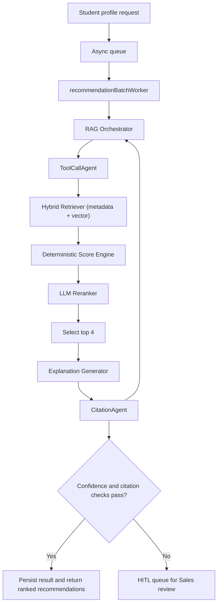
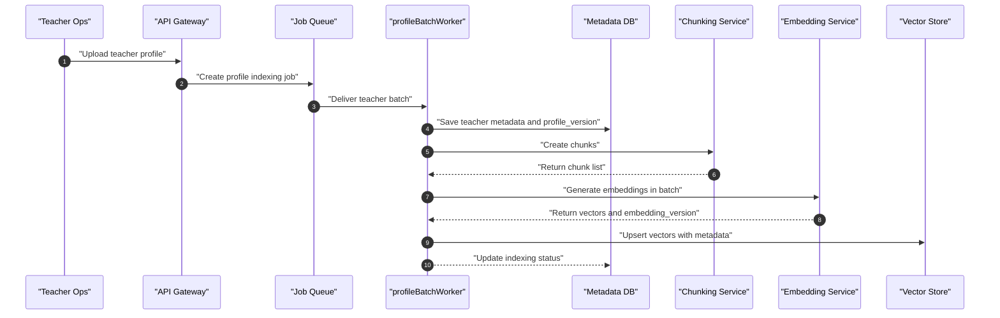
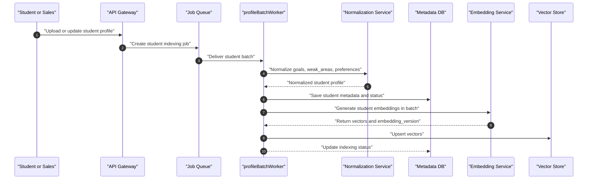
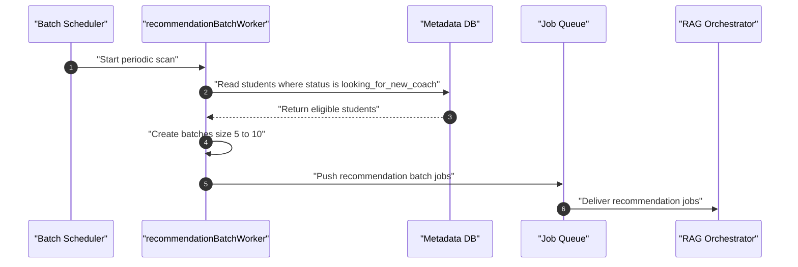

# AI Pipeline — Matching and Recommendation

## 1) Pipeline Objective

For each new student, return:
- `1` best-match teacher
- `3` alternatives
- LLM explanations backed by citations

## 2) End-to-End Pipeline Flow

## 3) Upload and Embedding Flows

### 3.1 Teacher Upload Flow

ToolCallAgent and CitationAgent involvement:
- `ToolCallAgent` is not used in teacher indexing because this flow is deterministic ETL (`chunk -> embed -> upsert`), not reasoning-heavy retrieval.
- `CitationAgent` is not used here because no recommendation explanation is generated at indexing time.
- Their dependency is indirect: this flow must persist stable `source_id` and `chunk_id` metadata so `CitationAgent` can cite evidence later.

### 3.2 Student Upload Flow

ToolCallAgent and CitationAgent involvement:
- `ToolCallAgent` is not used in student indexing for the same reason: normalization and embedding are deterministic data prep steps.
- `CitationAgent` is not used because there are no generated claims in this flow.
- The output of this flow (normalized fields and embeddings) is the retrieval substrate that `ToolCallAgent` queries in recommendation runs.

## 4) Recommendation Batch Trigger Flow

At this stage, `ToolCallAgent` and `CitationAgent` are not executed yet. They run inside each job handled by `RAG Orchestrator`.

## 5) Multi-Agent AI Design

### ToolCallAgent
- Tool-call-only policy (no unsupported free-form claims)
- Uses:
  - `semantic_search`
  - `web_search` (when needed)
  - internal profile/vector retrieval tools
- Operates inside `RAG Orchestrator` during recommendation jobs
- Produces structured retrieval traces: selected tools, tool inputs, returned chunks, and rationale tags
- Enforces bounded execution (max tool calls, timeout, and domain allowlist for web usage)

### CitationAgent
- Validates every explanation claim with evidence
- Attaches `source_id`, `chunk_id`, and `evidence_span`
- Rejects unsupported claims
- Receives explanation drafts and retrieval traces from upstream steps
- Returns per-claim verdicts (`supported`, `partially_supported`, `unsupported`) and a citation completeness score
- Can request claim rewrite or claim removal before final persistence

### OrchestratorAgent
- Coordinates agents and scoring pipeline
- Applies confidence threshold and HITL trigger
- Decides when to invoke `ToolCallAgent` (normal run, fallback retrieval, or web-enriched retrieval)
- Blocks final output unless `CitationAgent` passes critical-claim checks

### 5.1 Recommendation Runtime Contract

For each student recommendation job:
1. `OrchestratorAgent` builds an execution plan from student constraints and run config.
2. `ToolCallAgent` retrieves evidence candidates using approved tools only.
3. Score and rerank modules produce top candidates (`rank 1-4`).
4. Explanation generator drafts teacher-specific reasoning.
5. `CitationAgent` verifies every critical claim and attaches citations.
6. `OrchestratorAgent` applies confidence + citation gates and decides `finalOut` vs `HITL`.

### 5.2 ToolCallAgent Responsibilities in Workflow

- **Retrieval planning:** chooses the right mix of metadata filters, vector queries, and optional web queries.
- **Evidence gathering:** fetches candidate chunks from teacher profiles and policy/context sources.
- **Traceability:** logs every tool call for audit (`tool_name`, request, response hash, latency).
- **Fallback strategy:** if retrieval quality is low, retries with expanded queries and stricter filters.
- **Safety guardrails:** no direct claim writing to user output; outputs evidence only.

### 5.3 CitationAgent Responsibilities in Workflow

- **Claim extraction:** splits explanation into atomic claims.
- **Evidence linking:** maps each claim to one or more evidence spans.
- **Validation rules:** rejects citations with weak overlap, stale version, or missing source metadata.
- **Coverage checks:** enforces required citation coverage for high-impact claims (fit, outcomes, constraints).
- **Output shaping:** emits final `citation_set` and verification flags used by confidence gate.

### 5.4 Agent Inputs and Outputs

`ToolCallAgent` input:
- student profile features
- retrieval policy (allowed tools, limits, filters)
- optional `human_notes_version`

`ToolCallAgent` output:
- ranked evidence candidates with relevance signals
- retrieval trace for observability

`CitationAgent` input:
- explanation draft per teacher
- evidence candidates + source metadata

`CitationAgent` output:
- `citation_set` (`source_id`, `chunk_id`, `evidence_span`)
- claim-level support verdicts
- citation completeness and reliability score

### 5.5 Model Routing and Cost Optimization

To control LLM spend, the pipeline uses task-based model routing instead of a single model for all steps.

| Task Type | Pipeline Tasks | Model Tier | Target Quality | Cost Strategy |
|---|---|---|---|---|
| Simple / low-risk | Input normalization fallback, short field cleanup, explanation template polishing | **Cheap model** | Good-enough formatting accuracy | Always prefer low-cost model; retry once before fallback template |
| Moderate reasoning | LLM reranking of top candidates, explanation drafting per teacher | **Balanced model** | Strong semantic fit with stable latency | Default for production; bounded prompt size and strict token caps |
| High reasoning / high impact | Citation dispute resolution, ambiguous evidence adjudication, complex HITL rerun with conflicting constraints | **High-performance reasoning model** | Highest factual reliability and decision quality | Invoke only when quality gates fail or uncertainty is high |

Routing rules:
- Run deterministic retrieval/scoring first; call LLM only where semantic reasoning adds measurable value.
- Use cheap model for simple language tasks that do not affect ranking or safety outcomes.
- Escalate to high-performance model only for uncertain, high-impact decisions (for example, low citation coverage with conflicting evidence).
- If budget or rate limits are constrained, skip moderate/high model stages and use deterministic ranking plus templated explanations.
- Record selected `model_tier`, token usage, and latency in trace logs for cost and quality audits.

Suggested trigger policy:
- **Balanced -> High-performance escalation:** citation coverage `< 0.95`, confidence near threshold band, or HITL rerun with contradictory notes.
- **Balanced -> Cheap downgrade:** non-critical post-processing tasks (style cleanup, wording normalization) after core ranking is finalized.

## 6) HITL Rules

HITL handoff is triggered when:
- confidence score is below threshold
- critical claims have missing citations
- profile data is contradictory or sparse
- sales team requests manual review

Sales reviewer can:
- add correction notes
- adjust demand priorities
- set hard constraints

Then pipeline reruns with `human_notes_version`.

In HITL reruns:
- `ToolCallAgent` must include reviewer notes as hard constraints during retrieval planning.
- `CitationAgent` revalidates all claims because manual edits can invalidate prior citation links.
- `OrchestratorAgent` stores both pre-HITL and post-HITL traces for auditability.

## 7) Pipeline Outputs

Each completed request stores:
- ranked teacher list (`rank 1-4`)
- explanation text per teacher
- citation set per explanation
- confidence score and verification status
- full trace (`retrieval`, `scoring`, `rerank`, `citations`, `hitl`)
