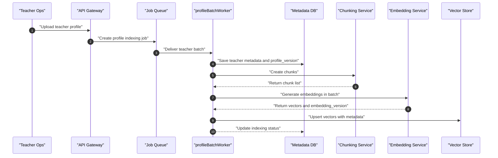
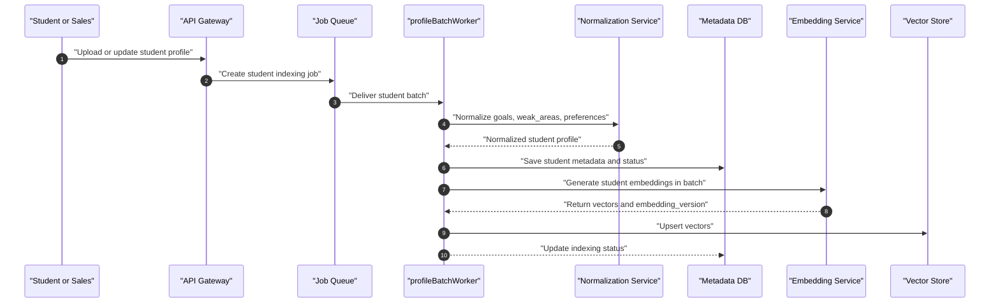
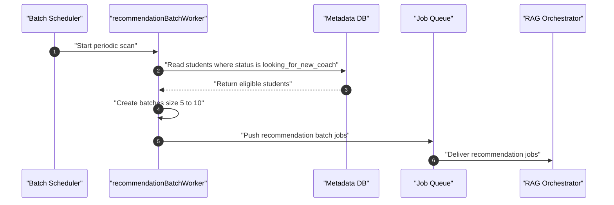
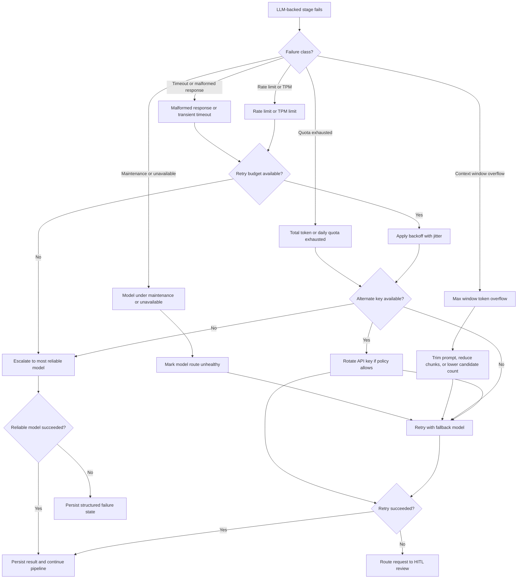

# AI Pipeline — Matching and Recommendation

## 1) Pipeline Objective

For each new student, return:
- `1` best-match teacher
- `3` alternatives
- LLM explanations backed by citations

## 2) UI to AI Pipeline Flow

```mermaid
flowchart LR
    studentUi["Student UI"]
    apiGateway["API Gateway"]
    metaDb["Metadata DB"]
    queueIn["Async Queue"]
    recommendationBatchWorker["recommendationBatchWorker"]

    subgraph aiPipeline["AI Pipeline"]
        orchestrator["RAG Orchestrator"]
        toolCallAgent["ToolCallAgent"]
        retriever["Hybrid Retriever (metadata + vector)"]
        scoreEngine["Recommendation Heuristic (provisional)"]
        reranker["LLM Reranker"]
        topK["Select top 4"]
        explainer["Explanation Generator"]
        citationAgent["CitationAgent"]
        confidenceGate{"Confidence and citation checks pass?"}
        hitlFlow["HITL Queue"]
    end

    studentUi -->|"Submit profile and request recommendation"| apiGateway
    apiGateway -->|"Create request row"| metaDb
    apiGateway -->|"Enqueue recommendation job"| queueIn
    queueIn --> recommendationBatchWorker
    recommendationBatchWorker -->|"Load job and dispatch run"| orchestrator
    orchestrator --> toolCallAgent
    toolCallAgent --> retriever
    retriever --> scoreEngine
    scoreEngine -->|"Shortlist and fallback signals"| reranker
    reranker --> topK
    topK --> explainer
    explainer --> citationAgent
    citationAgent --> confidenceGate
    confidenceGate -->|"Yes"| metaDb
    confidenceGate -->|"No"| hitlFlow
    hitlFlow -->|"Escalate for sales review and rerun"| metaDb
    metaDb -->|"Serve status and final result"| apiGateway
    apiGateway -->|"Return queued, processing, or completed response"| studentUi
```

Design note:
- Retrieval evidence, `LLM Reranker`, and `CitationAgent` determine the final recommendation outcome.
- The recommendation heuristic is a lightweight shortlist/fallback aid only and is explicitly provisional until calibrated using real outcomes or HITL reviewer feedback.

## 3) Upload and Embedding Flows

### 3.1 Teacher Upload Flow

ToolCallAgent and CitationAgent involvement:
- `ToolCallAgent` is not used in teacher indexing because this flow is deterministic ETL (`chunk -> embed -> upsert`), not reasoning-heavy retrieval.
- `CitationAgent` is not used here because no recommendation explanation is generated at indexing time.
- Their dependency is indirect: this flow must persist stable `source_id` and `chunk_id` metadata so `CitationAgent` can cite evidence later.

### 3.2 Student Upload Flow

ToolCallAgent and CitationAgent involvement:
- `ToolCallAgent` is not used in student indexing for the same reason: normalization and embedding are deterministic data prep steps.
- `CitationAgent` is not used because there are no generated claims in this flow.
- The output of this flow (normalized fields and embeddings) is the retrieval substrate that `ToolCallAgent` queries in recommendation runs.

## 4) Recommendation Batch Trigger Flow

At this stage, `ToolCallAgent` and `CitationAgent` are not executed yet. They run inside each job handled by `RAG Orchestrator`.

## 5) Multi-Agent AI Design

### ToolCallAgent
- Tool-call-only policy (no unsupported free-form claims)
- Uses:
  - `semantic_search`
  - `web_search` (when needed)
  - internal profile/vector retrieval tools
- Operates inside `RAG Orchestrator` during recommendation jobs
- Produces structured retrieval traces: selected tools, tool inputs, returned chunks, and rationale tags
- Enforces bounded execution (max tool calls, timeout, and domain allowlist for web usage)

### CitationAgent
- Validates every explanation claim with evidence
- Attaches `source_id`, `chunk_id`, and `evidence_span`
- Rejects unsupported claims
- Receives explanation drafts and retrieval traces from upstream steps
- Returns per-claim verdicts (`supported`, `partially_supported`, `unsupported`) and a citation completeness score
- Can request claim rewrite or claim removal before final persistence

### OrchestratorAgent
- Coordinates agents, heuristic pre-ranking, and reranking pipeline
- Applies confidence threshold and HITL trigger
- Decides when to invoke `ToolCallAgent` (normal run, fallback retrieval, or web-enriched retrieval)
- Blocks final output unless `CitationAgent` passes critical-claim checks
- Owns retry policy for all LLM-backed stages
- Routes failed requests to fallback models when the primary route is unhealthy
- Handles provider-side errors such as rate limits, token caps, maintenance windows, and malformed responses
- Escalates high-impact retries to the most reliable model when cheaper routes fail repeatedly

### 5.1 Recommendation Runtime Contract

For each student recommendation job:
1. `OrchestratorAgent` builds an execution plan from student constraints and run config.
2. `ToolCallAgent` retrieves evidence candidates using approved tools only.
3. Retrieval evidence is narrowed with a provisional heuristic, then reranked into final candidates (`rank 1-4`).
4. Explanation generator drafts teacher-specific reasoning.
5. `CitationAgent` verifies every critical claim and attaches citations.
6. `OrchestratorAgent` applies confidence + citation gates and decides `finalOut` vs `HITL`.

### 5.2 ToolCallAgent Responsibilities in Workflow

- **Retrieval planning:** chooses the right mix of metadata filters, vector queries, and optional web queries.
- **Evidence gathering:** fetches candidate chunks from teacher profiles and policy/context sources.
- **Traceability:** logs every tool call for audit (`tool_name`, request, response hash, latency).
- **Fallback strategy:** if retrieval quality is low, retries with expanded queries and stricter filters.
- **Safety guardrails:** no direct claim writing to user output; outputs evidence only.

### 5.3 CitationAgent Responsibilities in Workflow

- **Claim extraction:** splits explanation into atomic claims.
- **Evidence linking:** maps each claim to one or more evidence spans.
- **Validation rules:** rejects citations with weak overlap, stale version, or missing source metadata.
- **Coverage checks:** enforces required citation coverage for high-impact claims (fit, outcomes, constraints).
- **Output shaping:** emits final `citation_set` and verification flags used by confidence gate.

### 5.4 Agent Inputs and Outputs

`ToolCallAgent` input:
- student profile features
- retrieval policy (allowed tools, limits, filters)
- optional `human_notes_version`

`ToolCallAgent` output:
- ranked evidence candidates with relevance signals
- retrieval trace for observability

`CitationAgent` input:
- explanation draft per teacher
- evidence candidates + source metadata

`CitationAgent` output:
- `citation_set` (`source_id`, `chunk_id`, `evidence_span`)
- claim-level support verdicts
- citation completeness and reliability score

### 5.5 Model Routing and Cost Optimization

To control LLM spend, the pipeline uses task-based model routing instead of a single model for all steps.

| Task Type | Pipeline Tasks | Model Tier | Target Quality | Cost Strategy |
|---|---|---|---|---|
| Simple / low-risk | Input normalization fallback, short field cleanup, explanation template polishing | **Cheap model** | Good-enough formatting accuracy | Always prefer low-cost model; retry once before fallback template |
| Moderate reasoning | LLM reranking of top candidates, explanation drafting per teacher | **Balanced model** | Strong semantic fit with stable latency | Default for production; bounded prompt size and strict token caps |
| High reasoning / high impact | Citation dispute resolution, ambiguous evidence adjudication, complex HITL rerun with conflicting constraints | **High-performance reasoning model** | Highest factual reliability and decision quality | Invoke only when quality gates fail or uncertainty is high |

Routing rules:
- Run retrieval first, use the provisional heuristic only for shortlist/fallback support, and call LLM where semantic reasoning adds measurable value.
- Use cheap model for simple language tasks that do not affect ranking or safety outcomes.
- Escalate to high-performance model only for uncertain, high-impact decisions (for example, low citation coverage with conflicting evidence).
- If budget or rate limits are constrained, skip moderate/high model stages and use heuristic ordering plus templated explanations as a fallback mode.
- Record selected `model_tier`, token usage, and latency in trace logs for cost and quality audits.

Suggested trigger policy:
- **Balanced -> High-performance escalation:** citation coverage `< 0.95`, confidence near threshold band, or HITL rerun with contradictory notes.
- **Balanced -> Cheap downgrade:** non-critical post-processing tasks (style cleanup, wording normalization) after core ranking is finalized.

### 5.6 Orchestrator Failure and Provider Error Handling

`OrchestratorAgent` is responsible for turning provider-side AI failures into controlled, auditable behavior instead of silent quality drops or stuck jobs.

Provider failure/error classes handled by orchestrator:

| Failure Class | Example Signal | Orchestrator Interpretation | Default Action |
|---|---|---|---|
| Rate limit | HTTP `429`, quota headers, provider throttle message | Temporary capacity issue | Retry with backoff, then fallback model or alternate key |
| Max window token overflow | Context length exceeded, prompt too large | Request shape is invalid for current model window | Trim context, reduce candidates/chunks, retry on larger-window model |
| Tokens-per-minute limit | TPM quota exceeded | Temporary throughput saturation | Queue retry after cooldown, optionally rotate key or route to backup model |
| Total token / daily quota exhausted | Hard quota exceeded, billing limit, account cap | Current credential cannot continue serving | Rotate key if allowed, otherwise route to more reliable backup provider/model |
| Model under maintenance / unavailable | HTTP `503`, maintenance notice, model disabled | Model is temporarily unavailable | Retry different model tier immediately, avoid repeated attempts on unhealthy model |
| Timeout / transient network error | Timeout, connection reset, upstream gateway error | Potentially recoverable transport issue | Safe retry with jitter and max-attempt cap |
| Invalid response shape | Missing fields, malformed JSON, tool-call schema mismatch | Provider responded but output is unusable | One repair retry, then escalate to stricter or more reliable model |

Required orchestrator controls:

- **Retry budget:** each LLM-backed stage has bounded retries to avoid infinite loops and runaway cost.
- **Stage-aware fallback:** reranking, explanation generation, and citation verification can each choose a different backup model.
- **Idempotent recovery:** retries reuse the same `request_id` and trace context so duplicate outputs are not created.
- **Circuit breaking:** repeated provider failures should temporarily mark a model route as degraded and stop sending new traffic there.
- **Trace logging:** every retry, fallback, key switch, and final failure reason must be recorded for auditability.

Handling policy for the requested cases:

1. **Max window token**
   The orchestrator first reduces prompt size by trimming lower-value chunks, shortening history, or reducing candidate count. If quality-critical evidence still does not fit, it retries with a larger-context fallback model.
2. **Tokens per minute**
   The orchestrator treats this as a temporary saturation event. It applies exponential backoff with jitter, may rotate to another API key if policy allows, and then retries on a backup model when latency SLO is at risk.
3. **Total tokens limit**
   This is handled as a harder quota failure rather than a transient retry. The orchestrator should stop repeated attempts on the exhausted credential, rotate keys when available, or route to the most reliable backup model/provider even if cost is higher.
4. **Model under maintenance**
   The orchestrator marks that model as unhealthy for the current window and immediately reroutes traffic to a fallback model instead of retrying the same target aggressively.

Fallback methods supported by orchestrator:

- **Retry with fallback model:** default response for repeated `429`, `503`, or model-specific instability.
- **Key rotation:** allowed only when credentials belong to an approved shared pool and usage policy permits shifting load.
- **Retry with most reliable model even though expensive:** used for high-impact stages such as citation dispute resolution, borderline confidence decisions, or when cheaper tiers repeatedly fail quality or availability checks.

Suggested decision order:

1. Detect whether the failure is transient, quota-bound, request-shape-related, or model-health-related.
2. Retry once or twice only when the same request can plausibly succeed without structural changes.
3. If the issue is prompt/window related, shrink payload first; do not waste retries on the same oversized input.
4. If the issue is provider saturation, rotate key or change model route based on current health policy.
5. If the stage is high impact or repeated retries fail, escalate to the most reliable available model even at higher cost.
6. If all guarded retries fail, persist a structured failure state or route to `HITL` instead of returning an unsupported answer.

Recommended failure state recorded in trace:

- `failure_class`
- `provider_name`
- `model_name`
- `attempt_count`
- `fallback_action`
- `final_resolution` (`recovered`, `rerouted`, `hitl_review`, `failed`)
- `prompt_token_estimate`
- `response_token_estimate`
- `request_latency_ms`

## 6) HITL Rules

HITL handoff is triggered when:
- confidence score is below threshold
- critical claims have missing citations
- profile data is contradictory or sparse
- sales team requests manual review

Sales reviewer can:
- add correction notes
- adjust demand priorities
- set hard constraints

Then pipeline reruns with `human_notes_version`.

In HITL reruns:
- `ToolCallAgent` must include reviewer notes as hard constraints during retrieval planning.
- `CitationAgent` revalidates all claims because manual edits can invalidate prior citation links.
- `OrchestratorAgent` stores both pre-HITL and post-HITL traces for auditability.

## 7) Pipeline Outputs

Each completed request stores:
- ranked teacher list (`rank 1-4`)
- explanation text per teacher
- citation set per explanation
- confidence score and verification status
- full trace (`retrieval`, `heuristic`, `rerank`, `citations`, `hitl`)
