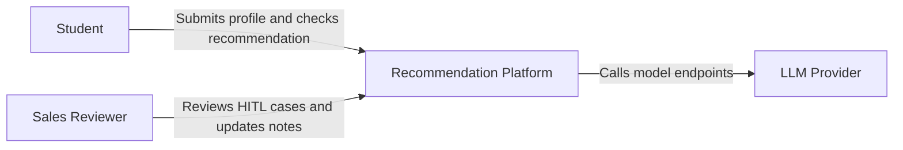
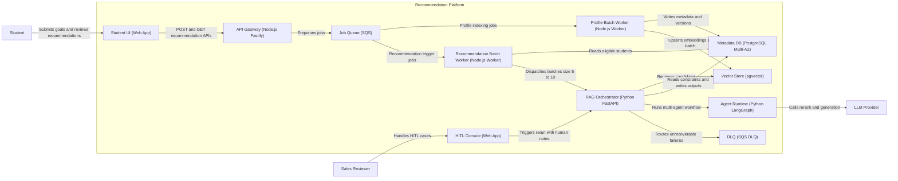
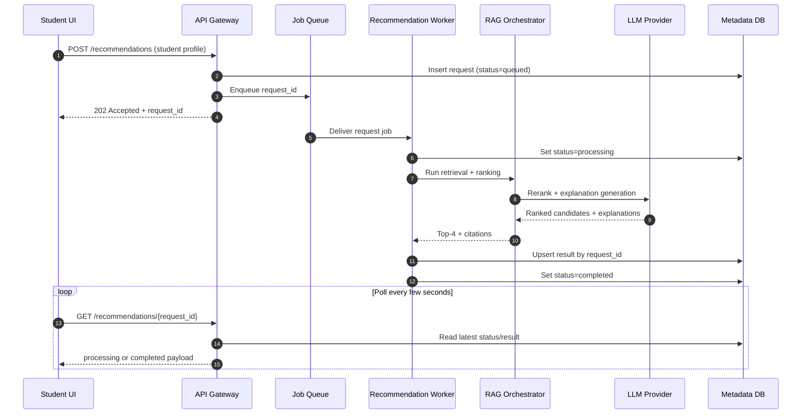
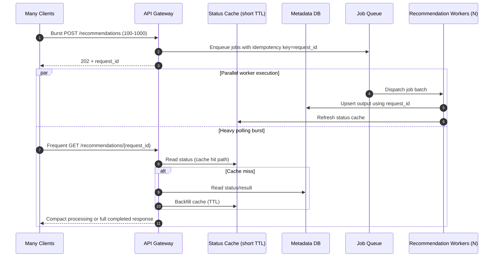

# Architecture — AI Coaching Recommendation System

This document focuses on system structure and runtime interaction boundaries. Detailed operational policy (model routing, fallback decision logic, and cost controls) is centralized in `implementation-plan.md` to avoid duplicated guidance across files.

## 1) System Architecture Overview

This architecture is designed for:
- Background recommendation execution
- RAG-based matching
- Multi-agent validation with citations
- Human-in-the-loop handoff

## 2) System Context Diagram



## 3) Container Architecture Diagram



## 4) Sequence Charts

### 4.1 Async Recommendation Flow



### 4.2 High-Concurrency Output Handling



## 5) Component Overview

- **Student UI (`Web App`)**
  - Collects student profile and learning goals
  - Calls async API and polls/refreshes by `request_id`
  - Displays ranked recommendations and explanations
- **API Gateway (`Node.js + Fastify`)**
  - Validates payloads
  - Creates async requests and returns `request_id`
  - Enforces per-student and per-IP rate limits to smooth burst traffic
  - Serves cached latest status for polling clients to reduce DB hot reads
- **Profile Batch Worker (`Node.js`)**
  - Collects uploaded profiles
  - Chunks and embeds in batch windows
- **Recommendation Batch Worker (`Node.js`)**
  - Picks eligible students (`looking_for_new_coach`)
  - Dispatches recommendation jobs in batch size `5-10`
  - Writes outputs with idempotent upsert (`request_id` key) to avoid duplicate result rows
- **RAG Orchestrator (`Python + FastAPI`)**
  - Hybrid retrieval, provisional heuristic pre-ranking, reranking, and explanation assembly
  - Final recommendation quality is driven by retrieval evidence, reranking, and citation validation rather than fixed heuristic weights
- **Agent Runtime (`LangGraph`)**
  - Tool-call-only retrieval agent
  - Citation verification agent
- **HITL Console**
  - Sales adjustments and correction notes
  - Manual handoff and rerun triggers

## 6) Output Contract

The recommendation response contract is explicit so downstream UI and API clients can be deterministic.

```json
{
  "request_id": "req_123",
  "student_id": "stu_456",
  "status": "completed",
  "top_1": {
    "teacher_id": "t_001",
    "rank": 1,
    "score": 0.92,
    "explanation": {
      "summary": "Best overall fit for Algebra goals and communication coaching.",
      "match_reasons": [
        "High Math score (92) aligns with weak area",
        "Teaching style matches student's preferred pace"
      ],
      "confidence": "high"
    },
    "citations": [
      {
        "source_type": "teacher_profile",
        "source_id": "teacher:t_001",
        "field": "subjects"
      },
      {
        "source_type": "teacher_metric",
        "source_id": "teacher:t_001",
        "field": "math_score"
      }
    ]
  },
  "top_3_alternatives": [
    {
      "teacher_id": "t_017",
      "rank": 2,
      "score": 0.86,
      "explanation": {
        "summary": "Strong alternative with balanced subject and communication fit.",
        "match_reasons": ["Strong subject coverage", "Good communication score"],
        "confidence": "medium"
      },
      "citations": [
        {
          "source_type": "teacher_profile",
          "source_id": "teacher:t_017",
          "field": "teaching_style"
        }
      ]
    }
  ]
}
```

Notes:
- `top_1` is the best-match teacher.
- `top_3_alternatives` is exactly three ranked alternatives (`rank` 2-4).
- Each selected teacher must include an `explanation` and `citations`.

### High-Concurrency Output Management

To handle 100 to 1,000 simultaneous recommendation requests, output delivery follows these rules:

- **Write-once request state machine**  
  Status transitions are monotonic (`queued -> processing -> completed|failed|hitl_review`) so clients never observe rollback states.
- **Idempotent output writes**  
  Workers upsert by `request_id`; duplicate jobs update the same record instead of creating conflicting results.
- **Poll-friendly API contract**  
  `GET /recommendations/{request_id}` returns compact status payload while processing and full payload only when completed.
- **Hot-read protection**  
  Latest request status is cached (short TTL) to absorb repeated UI polling spikes.
- **Bounded payload shape**  
  Output is fixed to top-4 entries (1 + 3 alternatives), preventing response-size growth during high load.
- **Backpressure visibility**  
  Optional response metadata can include `queue_position_estimate` and `retry_after_seconds` for better client behavior under backlog.

Compact in-progress response example:

```json
{
  "request_id": "req_123",
  "student_id": "stu_456",
  "status": "processing",
  "retry_after_seconds": 3
}
```

## 7) Minimum Viable Assignment Path (30-minute scope)

This path is the simplest deployable flow for the assignment while preserving async execution:

1. Student submits form in `Student UI`.
2. `API Gateway` validates input, creates `request_id`, stores request row in `Metadata DB`, and enqueues a job.
3. Single `Recommendation Worker` (can reuse `Recommendation Batch Worker`) reads job, runs retrieval + heuristic shortlist + one LLM rerank/explanation pass.
4. Worker writes `top_1` + `top_3_alternatives` and explanation/citations to `Metadata DB`.
5. Student UI polls `GET /recommendations/{request_id}` until `status=completed`, then renders results.

Optional advanced components (nice-to-have, not required for MVP):
- Separate `Profile Batch Worker` for large-scale embedding refresh.
- Dedicated `RAG Orchestrator` and `Agent Runtime` split for advanced multi-agent validation.
- `HITL Console` for low-confidence/manual review loops.
- `DLQ` replay automation and multi-AZ hardening beyond basic demo reliability.

## 8) High Availability Strategy

- Multi-AZ deployment for API and database.
- Queue decoupling for burst tolerance and controlled worker scaling.
- DLQ for hard failures and replay path.
- Idempotent workers to avoid duplicate processing.
- Read replicas or cached status layer to handle high-frequency polling without overloading primary DB.
- Request-level output deduplication keyed by `request_id` to keep responses consistent during retries.

Provider-specific fallback strategy, retry policy, and model-tier escalation rules are defined in `implementation-plan.md` (source of truth).
