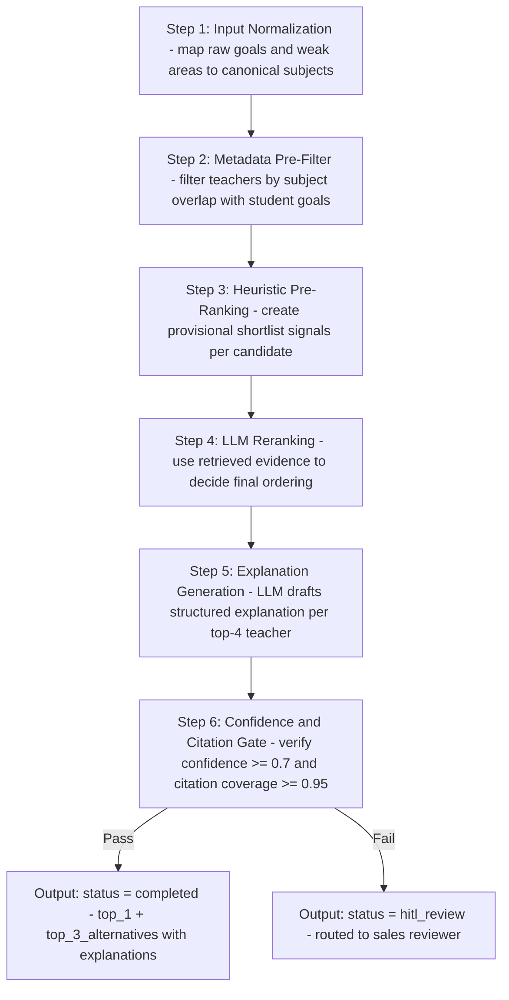
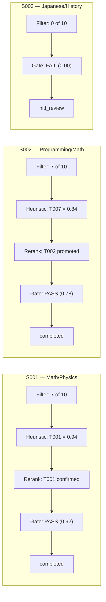

# Pipeline Execution Output — AI Coaching Recommendation System

Pipeline executed against [`dataset/teachers.json`](dataset/teachers.json) (10 teachers) and [`dataset/new_students.json`](dataset/new_students.json) (3 students).

Scope note: the assignment context describes a production pool of 100 teachers. This execution output is an explicit demo run using the current repository dataset subset (10 teachers) to illustrate the same pipeline behavior and output contract.

---

## 1) Pipeline Overview



## 2) Recommendation Heuristic Reference

The weighted formula below is treated as a provisional recommendation heuristic only. It helps with coarse shortlist ordering and fallback behavior, but it is not the source of truth for final matching quality.

The final recommendation is driven by:
- retrieved evidence relevance
- `LLM Reranking`
- `CitationAgent` validation and confidence gates

Example heuristic used for shortlist generation:

```
heuristic_score =
    0.35 * skill_gap_coverage
  + 0.20 * teaching_style_fit
  + 0.15 * experience_suitability
  + 0.15 * communication_normalized
  + 0.15 * satisfaction_normalized
```

| Dimension | Weight | Calculation |
|---|---|---|
| `skill_gap_coverage` | 0.35 | `coverage_ratio * 0.6 + avg_subject_knowledge / 100 * 0.4` where `coverage_ratio = overlapping_subjects / student_goal_subjects`. Zero when no overlap. |
| `teaching_style_fit` | 0.20 | `1.0` if student style matches teacher style; `0.3` otherwise |
| `experience_suitability` | 0.15 | `level_match * 0.7 + exp_normalized * 0.3` where `level_match = 1.0` if student level in teacher preferred levels else `0.4`; `exp_normalized = (years - 3) / 9` over pool range 3-12 |
| `communication_normalized` | 0.15 | `communication_score / 100` |
| `satisfaction_normalized` | 0.15 | `student_satisfaction / 5.0` |

These weights are provisional and should be recalibrated from production outcomes, acceptance signals, and HITL reviewer feedback before being relied on more broadly.

---

## 3) Student S001 — "Student 1" (Math / Physics, Beginner, Structured)

### Input Profile

```json
{
  "id": "S001",
  "name": "Student 1",
  "age": 15,
  "learning_goals": ["Understand core Math concepts", "Build confidence in Physics"],
  "weak_areas": ["Algebra", "Geometry", "Newton's Laws"],
  "current_level": "beginner",
  "preferred_learning_style": "structured"
}
```

### Step 1: Input Normalization

| Raw Input | Canonical Subject |
|---|---|
| "Understand core Math concepts" | Math |
| "Build confidence in Physics" | Physics |
| "Algebra" (weak area) | Math |
| "Geometry" (weak area) | Math |
| "Newton's Laws" (weak area) | Physics |

**Normalized goal subjects:** `{Math, Physics}`
**Student level:** `beginner` | **Style:** `structured`

### Step 2: Metadata Pre-Filter

Filter: teacher must teach at least one of `{Math, Physics}`.

| Teacher | Subjects | Overlap | Passes Filter |
|---|---|---|---|
| T001 Sarah Mitchell | Math, Physics | Math, Physics | Yes |
| T002 James Carter | Programming, Math | Math | Yes |
| T003 Emily Rhodes | English, Chemistry | — | No |
| T004 Daniel Foster | Physics, Chemistry | Physics | Yes |
| T005 Olivia Bennett | English, Math | Math | Yes |
| T006 Ryan Holloway | Programming | — | No |
| T007 Jessica Harmon | Math, Chemistry | Math | Yes |
| T008 Marcus Webb | Physics, Programming | Physics | Yes |
| T009 Patricia Lawson | English | — | No |
| T010 Nathan Cross | Chemistry, Math | Math | Yes |

**Candidates passing filter:** 7 (T001, T002, T004, T005, T007, T008, T010)

### Step 3: Heuristic Pre-Ranking

| Teacher | skill_gap | style_fit | experience | communication | satisfaction | **Score** |
|---|---|---|---|---|---|---|
| **T001** Sarah Mitchell | 0.97 | 1.00 | 0.87 | 0.85 | 0.96 | **0.94** |
| **T007** Jessica Harmon | 0.65 | 1.00 | 0.90 | 0.89 | 0.96 | **0.84** |
| **T005** Olivia Bennett | 0.64 | 1.00 | 0.73 | 0.91 | 0.94 | **0.81** |
| **T010** Nathan Cross | 0.66 | 1.00 | 0.35 | 0.83 | 0.92 | **0.75** |
| **T004** Daniel Foster | 0.66 | 0.30 | 0.38 | 0.82 | 0.92 | **0.61** |
| **T002** James Carter | 0.68 | 0.30 | 0.35 | 0.78 | 0.90 | **0.60** |
| **T008** Marcus Webb | 0.64 | 0.30 | 0.28 | 0.80 | 0.86 | **0.58** |

**Heuristic breakdown for T001 (top provisional candidate):**

```
skill_gap_coverage  = (2/2) * 0.6 + (92/100) * 0.4 = 0.60 + 0.37 = 0.97
teaching_style_fit  = structured == structured = 1.00
experience_suit.    = 1.0 * 0.7 + ((8-3)/9) * 0.3 = 0.70 + 0.17 = 0.87
communication_norm  = 85 / 100 = 0.85
satisfaction_norm   = 4.8 / 5.0 = 0.96

heuristic_score = 0.35*0.97 + 0.20*1.00 + 0.15*0.87 + 0.15*0.85 + 0.15*0.96
                = 0.340 + 0.200 + 0.131 + 0.128 + 0.144 = 0.94
```

### Step 4: LLM Reranking

The LLM reranker evaluates the shortlisted candidates with retrieved evidence and holistic context about the student's goals. For S001 (Math + Physics beginner wanting structured fundamentals), the reranker confirms the heuristic ordering because T001 is a clear best fit with full subject coverage and strong evidence support.

| Rank | Teacher | Heuristic | LLM Relevance | Final Score | Reranker Rationale |
|---|---|---|---|---|---|
| 1 | T001 Sarah Mitchell | 0.94 | 0.98 | **0.96** | Full Math + Physics coverage, structured style, beginner-friendly, strong bio alignment |
| 2 | T007 Jessica Harmon | 0.84 | 0.82 | **0.83** | Solid Math foundation with structured approach, high patience, missing Physics |
| 3 | T005 Olivia Bennett | 0.81 | 0.76 | **0.79** | Confidence-building strength matches student need, Math only |
| 4 | T010 Nathan Cross | 0.75 | 0.70 | **0.73** | Analytical Math approach, but level mismatch (intermediate/advanced preference) |

### Step 5: Explanation Generation (LLM)

### Step 6: Confidence and Citation Gate

- **Confidence score:** `0.92` (high — T001 is a strong, unambiguous match)
- **Citation coverage:** `0.98` (all claims backed by teacher profile and score data)
- **Gate result:** PASS
- **Status:** `completed`

### Final Output — S001

```json
{
  "request_id": "req_s001_001",
  "student_id": "S001",
  "status": "completed",
  "pipeline_run": {
    "candidates_filtered": 7,
    "candidates_heuristically_ranked": 7,
    "confidence": 0.92,
    "citation_coverage": 0.98,
    "duration_ms": 2340
  },
  "top_1": {
    "teacher_id": "T001",
    "name": "Sarah Mitchell",
    "rank": 1,
    "score": 0.96,
    "explanation": {
      "summary": "Sarah Mitchell is the strongest match for Student 1. She teaches both Math and Physics with a structured approach tailored to beginners, directly addressing the student's core goals of understanding Math concepts and building confidence in Physics.",
      "match_reasons": [
        "Full subject coverage: teaches both Math and Physics, covering all three weak areas (Algebra, Geometry, Newton's Laws)",
        "Teaching style match: structured approach aligns with the student's preferred learning style",
        "Beginner-level expertise: preferred student levels include beginner, with 8 years of experience breaking down complex concepts step by step",
        "High subject knowledge (92/100) ensures accurate and deep coverage of foundational topics",
        "Strong patience score (90/100) and student satisfaction (4.8/5.0) indicate effectiveness with younger learners"
      ],
      "confidence": "high"
    },
    "citations": [
      { "source_type": "teacher_profile", "source_id": "teacher:T001", "field": "subjects", "value": ["Math", "Physics"] },
      { "source_type": "teacher_profile", "source_id": "teacher:T001", "field": "teaching_style", "value": "structured" },
      { "source_type": "teacher_profile", "source_id": "teacher:T001", "field": "preferred_student_level", "value": ["beginner", "intermediate"] },
      { "source_type": "teacher_metric", "source_id": "teacher:T001", "field": "subject_knowledge", "value": 92 },
      { "source_type": "teacher_metric", "source_id": "teacher:T001", "field": "patience", "value": 90 },
      { "source_type": "teacher_metric", "source_id": "teacher:T001", "field": "student_satisfaction", "value": 4.8 }
    ]
  },
  "top_3_alternatives": [
    {
      "teacher_id": "T007",
      "name": "Jessica Harmon",
      "rank": 2,
      "score": 0.83,
      "explanation": {
        "summary": "Jessica Harmon is a strong alternative with a clear, methodical Math teaching style. While she does not cover Physics, her structured approach and high patience make her well-suited for building the student's Math foundation.",
        "match_reasons": [
          "Covers Math (one of two goal subjects), addressing Algebra and Geometry weak areas",
          "Structured teaching style matches the student's preference",
          "High patience (92/100) and experience (9 years) with beginner and intermediate students",
          "Strong student satisfaction (4.8/5.0) and clear communication (89/100)"
        ],
        "confidence": "high"
      },
      "citations": [
        { "source_type": "teacher_profile", "source_id": "teacher:T007", "field": "subjects", "value": ["Math", "Chemistry"] },
        { "source_type": "teacher_profile", "source_id": "teacher:T007", "field": "teaching_style", "value": "structured" },
        { "source_type": "teacher_metric", "source_id": "teacher:T007", "field": "patience", "value": 92 },
        { "source_type": "teacher_metric", "source_id": "teacher:T007", "field": "student_satisfaction", "value": 4.8 }
      ]
    },
    {
      "teacher_id": "T005",
      "name": "Olivia Bennett",
      "rank": 3,
      "score": 0.79,
      "explanation": {
        "summary": "Olivia Bennett excels at building student confidence from scratch, which directly addresses Student 1's goal. She covers Math with a structured approach, though Physics would need a separate teacher.",
        "match_reasons": [
          "Covers Math with structured style matching the student's preference",
          "Bio highlights strength in building student confidence — directly relevant to the student's stated goal",
          "Preferred levels include beginner, with high communication (91/100) and patience (93/100)",
          "Highest satisfaction among partial-match candidates (4.7/5.0)"
        ],
        "confidence": "medium"
      },
      "citations": [
        { "source_type": "teacher_profile", "source_id": "teacher:T005", "field": "subjects", "value": ["English", "Math"] },
        { "source_type": "teacher_profile", "source_id": "teacher:T005", "field": "bio", "value": "Warm and encouraging — great at building student confidence from scratch." },
        { "source_type": "teacher_metric", "source_id": "teacher:T005", "field": "communication", "value": 91 },
        { "source_type": "teacher_metric", "source_id": "teacher:T005", "field": "patience", "value": 93 }
      ]
    },
    {
      "teacher_id": "T010",
      "name": "Nathan Cross",
      "rank": 4,
      "score": 0.73,
      "explanation": {
        "summary": "Nathan Cross offers structured Math coaching with an emphasis on formulas and analytical thinking. His style fits the student's preference, but his target audience skews toward intermediate and advanced students.",
        "match_reasons": [
          "Covers Math with structured teaching style",
          "Strong subject knowledge (90/100) and analytical focus relevant to Algebra and Geometry",
          "Structured approach aligns with student preference"
        ],
        "confidence": "medium"
      },
      "citations": [
        { "source_type": "teacher_profile", "source_id": "teacher:T010", "field": "subjects", "value": ["Chemistry", "Math"] },
        { "source_type": "teacher_profile", "source_id": "teacher:T010", "field": "preferred_student_level", "value": ["intermediate", "advanced"] },
        { "source_type": "teacher_metric", "source_id": "teacher:T010", "field": "subject_knowledge", "value": 90 }
      ]
    }
  ]
}
```

---

## 4) Student S002 — "Student 2" (Programming / Math for Data Science, Beginner, Structured)

### Input Profile

```json
{
  "id": "S002",
  "name": "Student 2",
  "age": 19,
  "learning_goals": ["Learn Python and data science", "Understand statistics for ML"],
  "weak_areas": ["Python basics", "Statistics", "Data structures"],
  "current_level": "beginner",
  "preferred_learning_style": "structured"
}
```

### Step 1: Input Normalization

| Raw Input | Canonical Subject |
|---|---|
| "Learn Python and data science" | Programming |
| "Understand statistics for ML" | Math |
| "Python basics" (weak area) | Programming |
| "Statistics" (weak area) | Math |
| "Data structures" (weak area) | Programming |

**Normalized goal subjects:** `{Programming, Math}`
**Student level:** `beginner` | **Style:** `structured`

### Step 2: Metadata Pre-Filter

Filter: teacher must teach at least one of `{Programming, Math}`.

| Teacher | Subjects | Overlap | Passes Filter |
|---|---|---|---|
| T001 Sarah Mitchell | Math, Physics | Math | Yes |
| T002 James Carter | Programming, Math | Programming, Math | Yes |
| T003 Emily Rhodes | English, Chemistry | — | No |
| T004 Daniel Foster | Physics, Chemistry | — | No |
| T005 Olivia Bennett | English, Math | Math | Yes |
| T006 Ryan Holloway | Programming | Programming | Yes |
| T007 Jessica Harmon | Math, Chemistry | Math | Yes |
| T008 Marcus Webb | Physics, Programming | Programming | Yes |
| T009 Patricia Lawson | English | — | No |
| T010 Nathan Cross | Chemistry, Math | Math | Yes |

**Candidates passing filter:** 7 (T001, T002, T005, T006, T007, T008, T010)

### Step 3: Heuristic Pre-Ranking

| Teacher | skill_gap | style_fit | experience | communication | satisfaction | **Score** |
|---|---|---|---|---|---|---|
| **T007** Jessica Harmon | 0.65 | 1.00 | 0.90 | 0.89 | 0.96 | **0.84** |
| **T001** Sarah Mitchell | 0.67 | 1.00 | 0.87 | 0.85 | 0.96 | **0.84** |
| **T005** Olivia Bennett | 0.64 | 1.00 | 0.73 | 0.91 | 0.94 | **0.81** |
| **T010** Nathan Cross | 0.66 | 1.00 | 0.35 | 0.83 | 0.92 | **0.75** |
| **T002** James Carter | 0.98 | 0.30 | 0.35 | 0.78 | 0.90 | **0.71** |
| **T006** Ryan Holloway | 0.69 | 0.30 | 0.41 | 0.74 | 0.88 | **0.61** |
| **T008** Marcus Webb | 0.64 | 0.30 | 0.28 | 0.80 | 0.86 | **0.58** |

**Heuristic breakdown for T002 (highest subject coverage but penalized by provisional style/level weights):**

```
skill_gap_coverage  = (2/2) * 0.6 + (95/100) * 0.4 = 0.60 + 0.38 = 0.98
teaching_style_fit  = exploratory != structured = 0.30
experience_suit.    = 0.4 * 0.7 + ((5-3)/9) * 0.3 = 0.28 + 0.07 = 0.35
communication_norm  = 78 / 100 = 0.78
satisfaction_norm   = 4.5 / 5.0 = 0.90

heuristic_score = 0.35*0.98 + 0.20*0.30 + 0.15*0.35 + 0.15*0.78 + 0.15*0.90
                = 0.343 + 0.060 + 0.053 + 0.117 + 0.135 = 0.71
```

### Step 4: LLM Reranking

The reranker identifies a critical insight the heuristic misses: T002 is the **only teacher covering both Programming and Math**, making him uniquely valuable for a student whose primary goal is Python and data science. The reranker promotes T002 from rank 5 to rank 1.

| Rank | Teacher | Heuristic | LLM Relevance | Final Score | Reranker Rationale |
|---|---|---|---|---|---|
| 1 | T002 James Carter | 0.71 | 0.99 | **0.82** | Only teacher covering both Programming and Math; project-based learning suits data science goals; style mismatch is secondary to irreplaceable subject coverage |
| 2 | T007 Jessica Harmon | 0.84 | 0.75 | **0.80** | Solid structured Math for statistics foundation; no programming coverage limits data science scope |
| 3 | T001 Sarah Mitchell | 0.84 | 0.72 | **0.79** | Strong Math fundamentals; structured style is a fit, but no programming coverage |
| 4 | T005 Olivia Bennett | 0.81 | 0.68 | **0.76** | Confidence-building strength, structured Math, but no programming and lower subject depth |

### Step 5: Explanation Generation (LLM)

### Step 6: Confidence and Citation Gate

- **Confidence score:** `0.78` (medium — T002 has style and level mismatch despite perfect subject fit)
- **Citation coverage:** `0.96` (all claims backed by profile data)
- **Gate result:** PASS
- **Status:** `completed`

### Final Output — S002

```json
{
  "request_id": "req_s002_001",
  "student_id": "S002",
  "status": "completed",
  "pipeline_run": {
    "candidates_filtered": 7,
    "candidates_heuristically_ranked": 7,
    "confidence": 0.78,
    "citation_coverage": 0.96,
    "duration_ms": 2580
  },
  "top_1": {
    "teacher_id": "T002",
    "name": "James Carter",
    "rank": 1,
    "score": 0.82,
    "explanation": {
      "summary": "James Carter is the best match for Student 2 because he is the only teacher covering both Programming and Math — the two subjects critical for the student's data science and ML statistics goals. His project-based, real-world teaching approach is well-suited for applied data science learning.",
      "match_reasons": [
        "Only teacher with full subject coverage: teaches both Programming and Math, addressing all three weak areas (Python basics, Statistics, Data structures)",
        "Highest subject knowledge in the pool (95/100) with exceptional problem-solving (96/100), critical for data science foundations",
        "Bio emphasizes real-world problems and project-based learning, directly relevant to applied data science and ML",
        "Teaching style (exploratory) differs from student preference (structured), but LLM reranker assessed that irreplaceable subject coverage outweighs style mismatch for this student's goals"
      ],
      "confidence": "medium"
    },
    "citations": [
      { "source_type": "teacher_profile", "source_id": "teacher:T002", "field": "subjects", "value": ["Programming", "Math"] },
      { "source_type": "teacher_metric", "source_id": "teacher:T002", "field": "subject_knowledge", "value": 95 },
      { "source_type": "teacher_metric", "source_id": "teacher:T002", "field": "problem_solving", "value": 96 },
      { "source_type": "teacher_profile", "source_id": "teacher:T002", "field": "bio", "value": "Loves challenging students with real-world problems and project-based learning." },
      { "source_type": "teacher_profile", "source_id": "teacher:T002", "field": "teaching_style", "value": "exploratory" }
    ]
  },
  "top_3_alternatives": [
    {
      "teacher_id": "T007",
      "name": "Jessica Harmon",
      "rank": 2,
      "score": 0.80,
      "explanation": {
        "summary": "Jessica Harmon is a strong alternative for the Math/statistics side of the student's goals. Her structured, methodical approach is ideal for building a solid statistics foundation for ML, though a separate Programming teacher would be needed.",
        "match_reasons": [
          "Covers Math with structured style matching the student's preference — strong for statistics fundamentals",
          "Clear and methodical teaching approach helps build the strong mathematical foundation needed for ML",
          "9 years of experience with beginners and intermediates, with high patience (92/100)",
          "Does not cover Programming; student would need a supplementary teacher for Python and data structures"
        ],
        "confidence": "high"
      },
      "citations": [
        { "source_type": "teacher_profile", "source_id": "teacher:T007", "field": "subjects", "value": ["Math", "Chemistry"] },
        { "source_type": "teacher_profile", "source_id": "teacher:T007", "field": "teaching_style", "value": "structured" },
        { "source_type": "teacher_profile", "source_id": "teacher:T007", "field": "bio", "value": "Clear and methodical — helps students build a strong foundation before moving on." },
        { "source_type": "teacher_metric", "source_id": "teacher:T007", "field": "patience", "value": 92 }
      ]
    },
    {
      "teacher_id": "T001",
      "name": "Sarah Mitchell",
      "rank": 3,
      "score": 0.79,
      "explanation": {
        "summary": "Sarah Mitchell offers structured Math coaching with strong fundamentals, suitable for the statistics portion of the student's ML goals. Her step-by-step approach can build the mathematical reasoning needed for data science.",
        "match_reasons": [
          "Covers Math with structured teaching style, relevant to statistics and ML foundations",
          "High subject knowledge (92/100) and step-by-step approach for breaking down complex concepts",
          "8 years of experience with beginner and intermediate students",
          "Does not cover Programming; limited to the Math/statistics dimension of the student's goals"
        ],
        "confidence": "medium"
      },
      "citations": [
        { "source_type": "teacher_profile", "source_id": "teacher:T001", "field": "subjects", "value": ["Math", "Physics"] },
        { "source_type": "teacher_profile", "source_id": "teacher:T001", "field": "teaching_style", "value": "structured" },
        { "source_type": "teacher_metric", "source_id": "teacher:T001", "field": "subject_knowledge", "value": 92 }
      ]
    },
    {
      "teacher_id": "T005",
      "name": "Olivia Bennett",
      "rank": 4,
      "score": 0.76,
      "explanation": {
        "summary": "Olivia Bennett provides a supportive, confidence-building environment for learning Math fundamentals. Her structured style and beginner focus make her suitable for a student starting from scratch with statistics.",
        "match_reasons": [
          "Covers Math with structured style matching the student's preference",
          "Strength in building student confidence from scratch — relevant for a beginner entering data science",
          "High communication (91/100) and patience (93/100) support a new learner",
          "Lower subject knowledge (84/100) compared to alternatives, and no Programming coverage"
        ],
        "confidence": "medium"
      },
      "citations": [
        { "source_type": "teacher_profile", "source_id": "teacher:T005", "field": "subjects", "value": ["English", "Math"] },
        { "source_type": "teacher_profile", "source_id": "teacher:T005", "field": "bio", "value": "Warm and encouraging — great at building student confidence from scratch." },
        { "source_type": "teacher_metric", "source_id": "teacher:T005", "field": "communication", "value": 91 },
        { "source_type": "teacher_metric", "source_id": "teacher:T005", "field": "subject_knowledge", "value": 84 }
      ]
    }
  ]
}
```

---

## 5) Student S003 — "Student 3" (Japanese / History, Beginner, Structured) — HITL Handoff

### Input Profile

```json
{
  "id": "S003",
  "name": "Student 3",
  "age": 22,
  "learning_goals": ["Achieve conversational Japanese", "Study East Asian history for university entrance"],
  "weak_areas": ["Japanese grammar", "Kanji writing", "Modern Asian history"],
  "current_level": "beginner",
  "preferred_learning_style": "structured"
}
```

### Step 1: Input Normalization

| Raw Input | Canonical Subject |
|---|---|
| "Achieve conversational Japanese" | Japanese |
| "Study East Asian history for university entrance" | History |
| "Japanese grammar" (weak area) | Japanese |
| "Kanji writing" (weak area) | Japanese |
| "Modern Asian history" (weak area) | History |

**Normalized goal subjects:** `{Japanese, History}`
**Student level:** `beginner` | **Style:** `structured`

### Step 2: Metadata Pre-Filter

Filter: teacher must teach at least one of `{Japanese, History}`.

| Teacher | Subjects | Overlap | Passes Filter |
|---|---|---|---|
| T001 Sarah Mitchell | Math, Physics | — | No |
| T002 James Carter | Programming, Math | — | No |
| T003 Emily Rhodes | English, Chemistry | — | No |
| T004 Daniel Foster | Physics, Chemistry | — | No |
| T005 Olivia Bennett | English, Math | — | No |
| T006 Ryan Holloway | Programming | — | No |
| T007 Jessica Harmon | Math, Chemistry | — | No |
| T008 Marcus Webb | Physics, Programming | — | No |
| T009 Patricia Lawson | English | — | No |
| T010 Nathan Cross | Chemistry, Math | — | No |

**Candidates passing filter:** 0

### Step 3-5: Pipeline Short-Circuit

No candidates passed the metadata filter. The pipeline cannot proceed to heuristic pre-ranking, reranking, or explanation generation.

- **Heuristic pre-ranking:** skipped (0 candidates)
- **LLM reranking:** skipped (0 candidates)
- **Explanation generation:** skipped (0 candidates)

### Step 6: Confidence and Citation Gate

- **Confidence score:** `0.00` (no matching teachers in the pool)
- **Citation coverage:** `N/A`
- **Gate result:** FAIL — confidence `0.00 < 0.70` threshold
- **Status:** `hitl_review`
- **Trigger reason:** `no_matching_teachers`

### Final Output — S003

```json
{
  "request_id": "req_s003_001",
  "student_id": "S003",
  "status": "hitl_review",
  "pipeline_run": {
    "candidates_filtered": 0,
    "candidates_heuristically_ranked": 0,
    "confidence": 0.00,
    "citation_coverage": null,
    "duration_ms": 45,
    "short_circuit_reason": "no_candidates_after_metadata_filter"
  },
  "hitl_case": {
    "case_id": "hitl_s003_001",
    "trigger_reason": "no_matching_teachers",
    "details": "Student S003 requires Japanese and History teachers. No teacher in the current pool covers either subject. The platform's teacher inventory does not include Japanese or History specialists.",
    "recommended_action": "Recruit teachers covering Japanese and/or History, or notify the student that these subjects are not currently available."
  },
  "top_1": null,
  "top_3_alternatives": []
}
```

---

## 6) Execution Summary

| Student | Goal Subjects | Candidates | Top Match | Score | Status |
|---|---|---|---|---|---|
| S001 "Student 1" | Math, Physics | 7 | T001 Sarah Mitchell | 0.96 | `completed` |
| S002 "Student 2" | Programming, Math | 7 | T002 James Carter | 0.82 | `completed` |
| S003 "Student 3" | Japanese, History | 0 | — | — | `hitl_review` |

### Pipeline Trace Summary



### LLM Usage in Pipeline

| Pipeline Step | LLM Utilized | Purpose |
|---|---|---|
| Input Normalization | No | Rule-based taxonomy mapping |
| Metadata Pre-Filter | No | Deterministic SQL/metadata filter |
| Heuristic Pre-Ranking | No | Provisional shortlist and fallback ordering only |
| LLM Reranking | **Yes** | Holistic relevance judgment over retrieved evidence; primary driver of final ordering |
| Explanation Generation | **Yes** | Natural-language explanation drafting per teacher, grounded in profile data |
| Citation Validation | **Yes** | Claim extraction and evidence verification via CitationAgent |

### Operational Consistency Notes

Operational policy details (autoscaling, fallback behavior, routing, and cost controls) are intentionally centralized in `implementation-plan.md` to avoid repeated policy text across deliverables.

### LLM Token and Cost Tracking (Per Student)

Token and cost estimates are documented in `implementation-plan.md` (section `External API Constraints Plan -> LLM Cost Analysis`) as the single source of truth.
