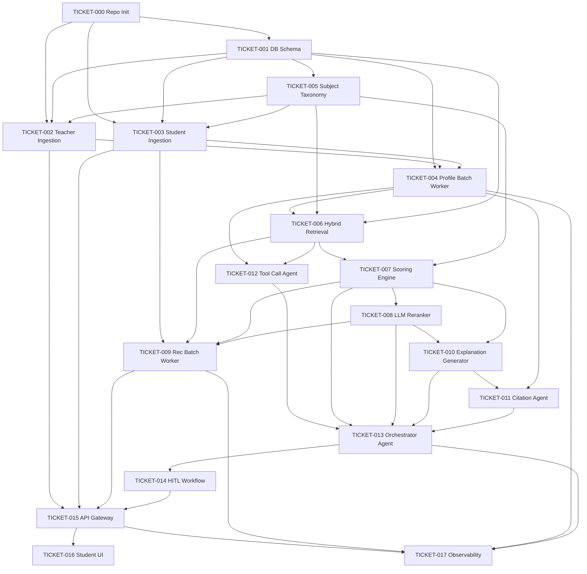
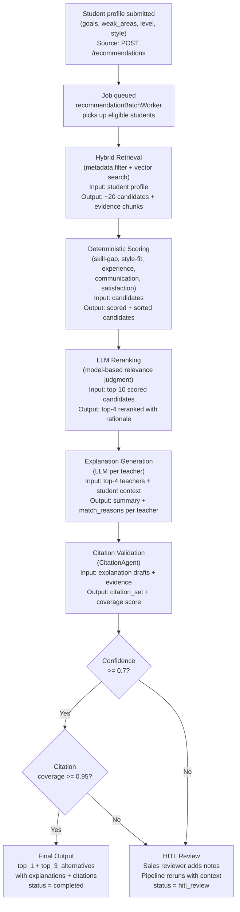
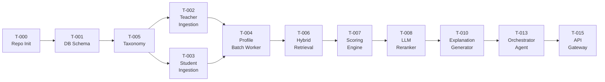

# AI Coaching Recommendation System — Implementation Tickets

## Ticket Index

This document is the master index for all implementation tickets. Each ticket is a self-contained markdown file in the [`tickets/`](tickets/) folder, organized by implementation phase.

Every ticket includes a **Test Plan** section with unit tests, integration tests, E2E/manual tests, and a requirement coverage matrix that maps each acceptance criterion to at least one test. All flow diagrams use **Mermaid** format.

---

## Phase Overview

| Phase | Focus | Tickets | Assignment Ref |
|---|---|---|---|
| **Phase 0** | Repository and Infrastructure Bootstrap | TICKET-000, TICKET-001 | Prerequisite for all deliverables |
| **Phase 1** | Data Model and Profile Indexing Pipeline | TICKET-002 — TICKET-005 | `assigment.md` Phase 1 context; `implementation-plan.md` Phase 1 |
| **Phase 2** | Retrieval and Ranking Pipeline | TICKET-006 — TICKET-009 | `assigment.md` Phase 1 goal; `implementation-plan.md` Phase 2 |
| **Phase 3** | Multi-Agent Explanation and Citation Validation | TICKET-010 — TICKET-014 | `assigment.md` Phase 1 explanations; `implementation-plan.md` Phase 3 |
| **Phase 4** | API, UI, and Operational Hardening | TICKET-015 — TICKET-017 | `assigment.md` Phase 2; `implementation-plan.md` Phase 4 |

---

## All Tickets

### Phase 0 — Repository and Infrastructure Bootstrap

| ID | Title | Description | Status |
|---|---|---|---|
| [TICKET-000](tickets/TICKET-000-repo-initialization.md) | Repository Initialization | Monorepo scaffolding, dependency manifests, Docker Compose, linting, CI skeleton | Pending |
| [TICKET-001](tickets/TICKET-001-database-schema-migrations.md) | Database Schema and Migrations | PostgreSQL schema, pgvector extension, migration files, seed scripts for `teachers.json` and `new_students.json` | Pending |

### Phase 1 — Data Model and Profile Indexing Pipeline

| ID | Title | Description | Status |
|---|---|---|---|
| [TICKET-002](tickets/TICKET-002-teacher-data-ingestion.md) | Teacher Data Ingestion | Teacher profile upload API endpoint, validation, persist to DB, enqueue indexing job | Pending |
| [TICKET-003](tickets/TICKET-003-student-data-ingestion.md) | Student Data Ingestion | Student profile upload API endpoint, normalization of goals and weak areas, persist to DB | Pending |
| [TICKET-004](tickets/TICKET-004-profile-batch-worker.md) | Profile Batch Worker | `profileBatchWorker`: chunking, embedding generation, vector upsert, batch windowing | Pending |
| [TICKET-005](tickets/TICKET-005-subject-skill-taxonomy.md) | Subject and Skill Taxonomy | Controlled `subjects`, `skills`, `skill_aliases` tables with seed data and normalization functions | Pending |

### Phase 2 — Retrieval and Ranking Pipeline

| ID | Title | Description | Status |
|---|---|---|---|
| [TICKET-006](tickets/TICKET-006-hybrid-retrieval.md) | Hybrid Retrieval | Metadata pre-filter + vector semantic search, candidate merge and dedup, progressive filter relaxation | Pending |
| [TICKET-007](tickets/TICKET-007-deterministic-scoring-engine.md) | Deterministic Scoring Engine | Composite match scoring: skill-gap coverage, teaching-style fit, experience, communication, satisfaction | Pending |
| [TICKET-008](tickets/TICKET-008-llm-reranker.md) | LLM Reranker | LLM-based reranking of top candidates, blended scoring, fallback to deterministic-only, circuit breaker | Pending |
| [TICKET-009](tickets/TICKET-009-recommendation-batch-worker.md) | Recommendation Batch Worker | `recommendationBatchWorker`: periodic scan, batch dispatch (size 5-10), queue integration, retry and DLQ | Pending |

### Phase 3 — Multi-Agent Explanation and Citation Validation

| ID | Title | Description | Status |
|---|---|---|---|
| [TICKET-010](tickets/TICKET-010-explanation-generator.md) | Explanation Generator | LLM-generated explanations per teacher with structured output, template fallback | Pending |
| [TICKET-011](tickets/TICKET-011-citation-agent.md) | Citation Agent | `CitationAgent`: claim extraction, evidence linking, coverage checks, unsupported claim rejection | Pending |
| [TICKET-012](tickets/TICKET-012-tool-call-agent.md) | Tool Call Agent | `ToolCallAgent` via LangGraph: tool-call-only retrieval, semantic search, profile lookup, retrieval traces | Pending |
| [TICKET-013](tickets/TICKET-013-orchestrator-agent.md) | Orchestrator Agent | `OrchestratorAgent`: full pipeline coordination, confidence gates, HITL trigger, trace recording | Pending |
| [TICKET-014](tickets/TICKET-014-hitl-workflow.md) | HITL Workflow | Human-in-the-loop case creation, sales console, correction notes, pipeline rerun with `human_notes_version` | Pending |

### Phase 4 — API, UI, and Operational Hardening

| ID | Title | Description | Status |
|---|---|---|---|
| [TICKET-015](tickets/TICKET-015-api-gateway.md) | API Gateway | Fastify REST API: recommendation endpoints, profile endpoints, HITL endpoints, rate limiting, OpenAPI spec | Pending |
| [TICKET-016](tickets/TICKET-016-student-ui.md) | Student UI | Web app: student form, async polling, recommendation display with explanations and citations | Pending |
| [TICKET-017](tickets/TICKET-017-observability-load-testing.md) | Observability and Load Testing | Metrics, dashboards, SLO alerts, load tests (100-1,000 concurrent), batch size and retry tuning | Pending |

---

## Assignment Deliverable Cross-Reference

This table maps each assignment deliverable to the tickets that implement or contribute to it.

| Deliverable | Content | Contributing Tickets |
|---|---|---|
| `data-model.md` | Entities, relationships, schema design | [TICKET-001](tickets/TICKET-001-database-schema-migrations.md), [TICKET-005](tickets/TICKET-005-subject-skill-taxonomy.md) |
| `architecture.md` | System architecture diagram + component overview | [TICKET-000](tickets/TICKET-000-repo-initialization.md), [TICKET-015](tickets/TICKET-015-api-gateway.md), [TICKET-016](tickets/TICKET-016-student-ui.md) |
| `ai-pipeline.md` | AI matching and recommendation pipeline | [TICKET-004](tickets/TICKET-004-profile-batch-worker.md), [TICKET-006](tickets/TICKET-006-hybrid-retrieval.md), [TICKET-007](tickets/TICKET-007-deterministic-scoring-engine.md), [TICKET-008](tickets/TICKET-008-llm-reranker.md), [TICKET-010](tickets/TICKET-010-explanation-generator.md), [TICKET-011](tickets/TICKET-011-citation-agent.md), [TICKET-012](tickets/TICKET-012-tool-call-agent.md), [TICKET-013](tickets/TICKET-013-orchestrator-agent.md) |
| `implementation-plan.md` | Concurrency, API constraints, freshness, evaluation | [TICKET-004](tickets/TICKET-004-profile-batch-worker.md), [TICKET-008](tickets/TICKET-008-llm-reranker.md), [TICKET-009](tickets/TICKET-009-recommendation-batch-worker.md), [TICKET-010](tickets/TICKET-010-explanation-generator.md), [TICKET-014](tickets/TICKET-014-hitl-workflow.md), [TICKET-017](tickets/TICKET-017-observability-load-testing.md) |
| `output.md` | Pipeline trace, final selection, LLM explanations | [TICKET-007](tickets/TICKET-007-deterministic-scoring-engine.md), [TICKET-010](tickets/TICKET-010-explanation-generator.md), [TICKET-013](tickets/TICKET-013-orchestrator-agent.md) |

---

## Assignment Requirement Coverage

| Requirement (from `assigment.md`) | Covered By |
|---|---|
| Find best-match teacher + 3 alternatives | [TICKET-006](tickets/TICKET-006-hybrid-retrieval.md), [TICKET-007](tickets/TICKET-007-deterministic-scoring-engine.md), [TICKET-008](tickets/TICKET-008-llm-reranker.md) |
| Explanation for each match | [TICKET-010](tickets/TICKET-010-explanation-generator.md), [TICKET-011](tickets/TICKET-011-citation-agent.md) |
| Pipeline utilizes LLM where it adds value | [TICKET-004](tickets/TICKET-004-profile-batch-worker.md) (embeddings), [TICKET-008](tickets/TICKET-008-llm-reranker.md) (reranking), [TICKET-010](tickets/TICKET-010-explanation-generator.md) (explanations), [TICKET-012](tickets/TICKET-012-tool-call-agent.md) (retrieval) |
| Expose an API | [TICKET-015](tickets/TICKET-015-api-gateway.md) |
| Implement a UI | [TICKET-016](tickets/TICKET-016-student-ui.md) |
| Pipeline runs in the background | [TICKET-009](tickets/TICKET-009-recommendation-batch-worker.md), [TICKET-013](tickets/TICKET-013-orchestrator-agent.md) |
| Concurrency (100-1,000 students) | [TICKET-009](tickets/TICKET-009-recommendation-batch-worker.md), [TICKET-017](tickets/TICKET-017-observability-load-testing.md) |
| External API constraints | [TICKET-008](tickets/TICKET-008-llm-reranker.md) (circuit breaker, fallback), [TICKET-012](tickets/TICKET-012-tool-call-agent.md) (LLM/web timeout + tier routing), [TICKET-013](tickets/TICKET-013-orchestrator-agent.md) (tiered escalation policy), [TICKET-017](tickets/TICKET-017-observability-load-testing.md) (rate limiting and cost observability) |
| Data freshness | [TICKET-004](tickets/TICKET-004-profile-batch-worker.md) (re-embedding), [TICKET-002](tickets/TICKET-002-teacher-data-ingestion.md) / [TICKET-003](tickets/TICKET-003-student-data-ingestion.md) (profile versioning) |
| Evaluation | [TICKET-017](tickets/TICKET-017-observability-load-testing.md) (metrics and SLOs) |
| Pipeline trace in output | [TICKET-013](tickets/TICKET-013-orchestrator-agent.md) (trace recording) |

---

## Dependency Graph

---

## Pipeline Trace

The end-to-end pipeline that runs for each student recommendation request. Each step corresponds to one or more tickets and writes a trace entry to `pipeline_trace_steps`.

---

## Execution Priorities

### Critical Path (minimum viable pipeline)

The shortest path to a working recommendation for one student:

### Parallelization Opportunities

These ticket groups can be worked on in parallel within each phase:

- **Phase 0:** TICKET-000 first, then TICKET-001 (sequential dependency).
- **Phase 1:** TICKET-005 first, then TICKET-002 and TICKET-003 in parallel, then TICKET-004.
- **Phase 2:** TICKET-006 -> TICKET-007 -> TICKET-008 (sequential). TICKET-009 can start once TICKET-006 is done.
- **Phase 3:** TICKET-012 can start with TICKET-010. TICKET-011 depends on TICKET-010. TICKET-013 is the integrator. TICKET-014 follows TICKET-013.
- **Phase 4:** TICKET-015, TICKET-016, TICKET-017 have limited parallelism (TICKET-016 and TICKET-017 both depend on TICKET-015).

---

## Design Document References

All tickets reference these design documents for detailed specifications:

| Document | Content |
|---|---|
| [data-model.md](data-model.md) | Entity definitions, PostgreSQL schema, vector model, versioning rules |
| [architecture.md](architecture.md) | C4 diagrams, component overview, output contract, HA strategy |
| [ai-pipeline.md](ai-pipeline.md) | Pipeline flow, upload/embedding flows, multi-agent design, HITL rules |
| [implementation-plan.md](implementation-plan.md) | Delivery approach, concurrency, API constraints, freshness, evaluation, tech stack |
| [technical-proposal.md](technical-proposal.md) | Full technical proposal with FR/NFR, sequence charts, technology selection rationale |

## Dataset Files

| File | Content | Used By |
|---|---|---|
| [dataset/teachers.json](dataset/teachers.json) | 10 teacher profiles (T001-T010) | TICKET-001 (seed), TICKET-002 (ingestion), TICKET-004 (embedding), TICKET-007 (scoring) |
| [dataset/new_students.json](dataset/new_students.json) | 3 student profiles (S001-S003) | TICKET-001 (seed), TICKET-003 (ingestion), TICKET-006 (retrieval queries), TICKET-010 (explanations) |
