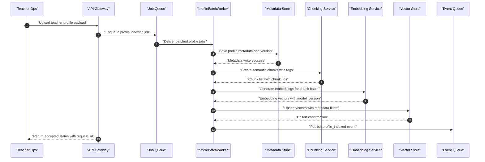
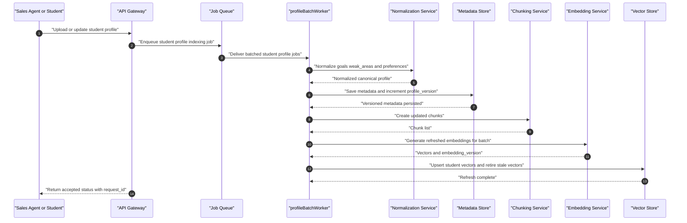
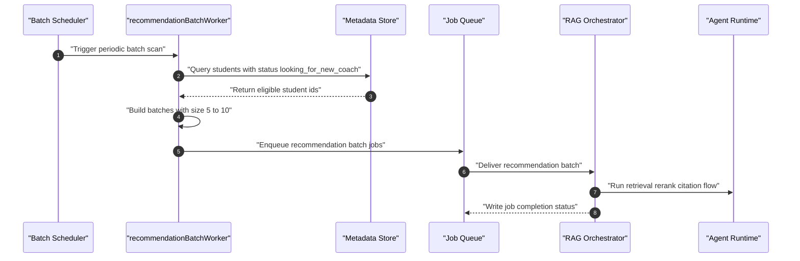
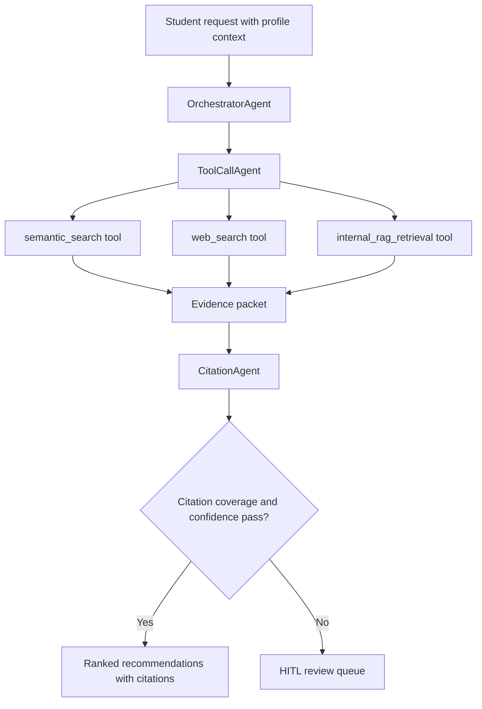
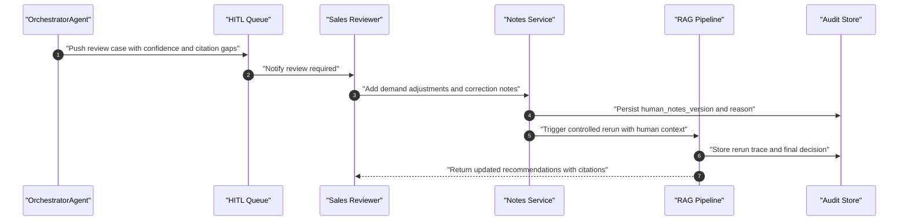
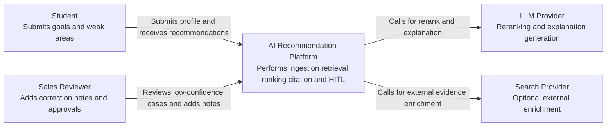
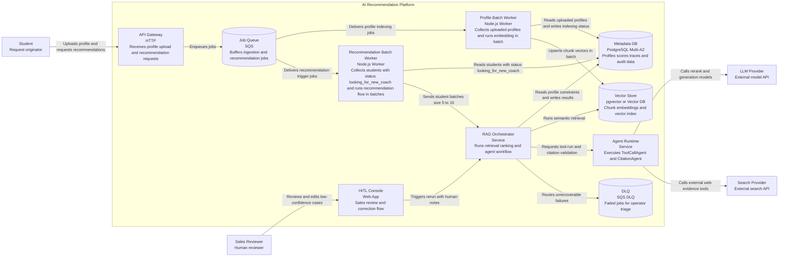

# AI/RAG Technical Proposal — Coaching Recommendation Intelligence

## 1) Objective and Scope

This document intentionally focuses on the AI intelligence layer only:
- Profile ingestion and RAG indexing for students and teachers
- Retrieval, reranking, recommendation, and explanation generation
- Multi-agent architecture with citation enforcement
- Human-in-the-loop (HITL) handoff and sales-side correction loop
- High availability represented with C4 diagrams

Out of scope: generic UI design, non-AI product modules, and unrelated platform features.

---

## 2) AI Pipeline Requirements (AI-Only FR/NFR)

### Functional Requirements
- `FR-1`: Accept teacher and student profile uploads with schema validation and profile versioning.
- `FR-2`: Save metadata first, then create chunks and embeddings, and upsert vectors.
- `FR-3`: Execute hybrid RAG retrieval (`metadata_filter + semantic_vector_search`) for each student request.
- `FR-4`: Rank candidates by deterministic score plus LLM rerank signal.
- `FR-5`: Run citation-aware explanation generation for `top_1 + next_3` teachers.
- `FR-6`: Trigger HITL handoff when confidence or citation quality is below threshold.
- `FR-7`: Persist full trace (`retrieved_docs`, `tool_calls`, `scores`, `citations`, `human_edits`).

### Non-Functional Requirements
- `NFR-1`: P95 recommendation response < 8 seconds at baseline load.
- `NFR-2`: RAG retrieval availability >= 99.9% monthly.
- `NFR-3`: End-to-end pipeline supports bursts of 1,000 concurrent requests via queue-backed workers.
- `NFR-4`: Explanation outputs must pass citation coverage >= 95% of claims.
- `NFR-5`: Profile-to-index freshness SLA <= 5 minutes for normal updates.
- `NFR-6`: LLM/tool failures must degrade gracefully to deterministic ranking + templated justification.

---

## 3) RAG Data Model for Profiles

### Teacher Profile Document
- `teacher_id`
- `profile_version`
- `subjects[]`
- `teaching_style`
- `experience_years`
- `skill_scores{subject:score}`
- `sales_notes[]`
- `source_timestamp`
- `embedding_version`

### Student Profile Document
- `student_id`
- `profile_version`
- `learning_goals[]`
- `weak_areas[]`
- `preferred_style`
- `constraints{language,time,budget}`
- `sales_notes[]`
- `source_timestamp`
- `embedding_version`

### Chunk Metadata
- `doc_id`
- `doc_type` (`teacher` or `student`)
- `entity_id`
- `profile_version`
- `chunk_id`
- `chunk_text`
- `tags[]`
- `created_at`

---

## 4) Student/Teacher Upload Flows (Sequence Charts)

### 4.1 Teacher Upload -> Queue -> `profileBatchWorker` -> Embedding

### 4.2 Student Upload/Update -> Queue -> `profileBatchWorker` -> Embedding Refresh

### 4.3 Recommendation Trigger -> `recommendationBatchWorker` -> RAG Pipeline (Batch `5-10`)

---

## 5) Retrieval, Ranking, and Explanation Pipeline

1. Build query intent from `learning_goals`, `weak_areas`, `constraints`, and optional sales notes.
2. Run hybrid retrieval:
   - `metadata_filter`: subject, language, availability, policy flags
   - `vector_search`: semantic proximity over teacher chunks
3. Merge and deduplicate candidates; attach retrieved evidence snippets.
4. Calculate deterministic score:
   - skill-gap coverage
   - teaching-style fit
   - experience suitability
   - policy and business constraints
5. Run reranker for top candidate window.
6. Select `top_4`.
7. Generate explanation drafts.
8. Send explanations to citation validator; remove unsupported claims.
9. If risk thresholds fail, trigger HITL handoff.
10. Persist final recommendations with citations, confidence, and full trace.

---

## 6) Multi-Agent AI Architecture

### Agent Roles
- **ToolCallAgent**:
  - Tool-call-only execution policy
  - Allowed tools: `semantic_search`, `web_search`, internal retrieval APIs, policy checks
  - Produces structured evidence packets only (no free-form final claims)
- **CitationAgent**:
  - Validates each recommendation claim against retrieved evidence
  - Adds citation pointers (`source_id`, `chunk_id`, `evidence_span`)
  - Rejects or rewrites unsupported statements
- **OrchestratorAgent**:
  - Coordinates tool flow
  - Enforces confidence gates and HITL triggers
  - Produces final machine-readable output for delivery

### Agent Contract (JSON Shape)
- `candidate_id`
- `score_breakdown`
- `claims[]`
- `citations[]`
- `confidence`
- `verification_status`
- `needs_human_review`

### Multi-Agent Flow (Mermaid)

---

## 7) Human-in-the-Loop (HITL) Handoff and Sales Feedback

### HITL Trigger Conditions
- `confidence < threshold`
- Missing citation for any high-impact claim
- Sparse student profile or contradictory constraints
- Policy flag requiring manual approval
- Sales escalation request

### Sales-Side Handoff Model
- Sales reviewer receives:
  - top candidates
  - rejected/low-confidence claims
  - evidence and citation gaps
- Sales reviewer can:
  - add correction notes
  - adjust student demand emphasis
  - mark hard constraints
- System writes `human_notes_version` and reruns retrieval/ranking with appended context.

### HITL Sequence (Mermaid)

---

## 8) HA Architecture Using C4

### 8.1 C4 Context

### 8.2 C4 Container

### 8.3 C4 Component (Inside RAG Orchestrator)

```mermaid
flowchart LR
    subgraph ragBoundary["RAG Orchestrator"]
        queryBuilder["Query Builder<br/>Module<br/>Builds retrieval intent from profile and notes"]
        hybridRetriever["Hybrid Retriever<br/>Module<br/>Runs metadata and vector retrieval"]
        scoreEngine["Score Engine<br/>Module<br/>Computes deterministic candidate score"]
        reranker["LLM Reranker<br/>Module<br/>Applies model-based reranking"]
        explanationComposer["Explanation Composer<br/>Module<br/>Drafts personalized explanations"]
        citationValidator["Citation Validator<br/>Module<br/>Verifies claims against evidence"]
        confidenceGate["Confidence Gate<br/>Module<br/>Triggers HITL if thresholds fail"]
    end

    metaDb[("Metadata DB<br/>PostgreSQL Multi-AZ<br/>Profile and trace storage")]
    vectorDb[("Vector Store<br/>pgvector or Vector DB<br/>Embedding retrieval")]
    agentRuntime["Agent Runtime<br/>Service<br/>ToolCallAgent and CitationAgent execution"]

    queryBuilder -->|"Creates retrieval query"| hybridRetriever
    hybridRetriever -->|"Reads semantic neighbors"| vectorDb
    hybridRetriever -->|"Reads metadata filters"| metaDb
    hybridRetriever -->|"Provides candidate set"| scoreEngine
    scoreEngine -->|"Provides top candidate window"| reranker
    reranker -->|"Provides reranked candidates"| explanationComposer
    explanationComposer -->|"Submits claims and evidence mapping"| citationValidator
    citationValidator -->|"Returns verification and confidence"| confidenceGate
    confidenceGate -->|"Writes trace status and handoff state"| metaDb
    citationValidator -->|"Runs evidence and citation checks"| agentRuntime
```

## 9) AI Pipeline Operational Controls

### Concurrency and Backpressure
- Queue-first execution for upload and recommendation jobs.
- Worker autoscaling based on queue depth and processing latency.
- Rate limits per tenant for `upload`, `retrieve`, and `rerank` endpoints.
- Token budget and QPS throttling per LLM provider key.
- `profileBatchWorker` collects new student/teacher uploads and runs embedding in configurable batch windows.
- `recommendationBatchWorker` pulls students with `status = looking_for_new_coach` and triggers recommendation in batches of `5 to 10`.
- Batch policy starts at size `5`, scales to `10` during queue pressure, and falls back to smaller batches when LLM latency rises.

### Reliability and Resilience
- Idempotency key on profile upload and recommendation request.
- Retry policy with exponential backoff for transient tool and model errors.
- Circuit breaker around `LLM` and `web_search` dependencies.
- DLQ triage workflow with replay after correction.

### Data Freshness and Re-Embedding
- Trigger re-embedding on profile updates and material sales note changes.
- Nightly compaction and stale vector cleanup by `profile_version`.
- Freshness SLO: 99% of updates indexed in <= 5 minutes.

### Governance and Safety
- Tool-call-only policy for retrieval agent to reduce hallucinated sourcing.
- Citation gate blocks unsupported claims from reaching end users.
- Full audit trail for human overrides with `reason_code` and `editor_id`.
- PII masking before external tool calls.

### Quality Metrics
- `retrieval_recall_at_k`
- `citation_coverage_rate`
- `unsupported_claim_rate`
- `hitl_trigger_rate`
- `hitl_override_rate`
- `recommendation_acceptance_lift`

---

## 10) Technical Selections by System Part (With Pros and Cons)

### 10.1 Metadata Database

#### Option A: `PostgreSQL` (Recommended)
- **Pros**
  - Strong transactional consistency for profile updates, status transitions, and audit trail.
  - Mature JSON support (`jsonb`) for flexible profile attributes and sales notes.
  - Native fit with `pgvector` if you want fewer moving parts in early phase.
  - Broad ecosystem and managed HA support.
- **Cons**
  - Vertical scaling limits appear earlier than distributed NoSQL for extreme write bursts.
  - Requires careful indexing and partitioning once trace volume grows.

#### Option B: `MySQL`
- **Pros**
  - Mature operational tooling and broad hosting support.
  - Reliable OLTP performance for straightforward relational schemas.
- **Cons**
  - Weaker native JSON ergonomics compared to PostgreSQL for semi-structured profile payloads.
  - Less natural path if you plan to use `pgvector`-style co-location strategy.

### 10.2 Vector Database

#### Option A: `Pinecone`
- **Pros**
  - Fully managed vector operations and simple scaling model.
  - Good for fast production onboarding with minimal infra management.
  - Built-in filtering and namespace features help multi-tenant isolation.
- **Cons**
  - Higher vendor lock-in.
  - Ongoing cost can grow quickly at high query and storage volume.
  - Cross-system transaction consistency with metadata DB requires extra design.

#### Option B: `Weaviate`
- **Pros**
  - Flexible schema and hybrid search capabilities.
  - Can be self-hosted or managed, giving more deployment flexibility.
  - Rich feature set for semantic retrieval pipelines.
- **Cons**
  - Operational overhead is higher if self-managed.
  - Performance tuning complexity can be non-trivial for mixed workloads.

#### Option C: `pgvector` on PostgreSQL (Phase-1 baseline)
- **Pros**
  - Simple architecture with one persistence layer for metadata + vectors.
  - Strong transactional coupling between profile writes and index updates.
  - Lower operational complexity for MVP and assignment scope.
- **Cons**
  - Retrieval scale and latency can lag specialized vector engines at large corpus sizes.
  - Requires disciplined indexing and tuning as vectors grow.

### 10.3 API and Profile Services

#### Option A: `Node.js + Fastify + Swagger OpenAPI` (Recommended for profile/API)
- **Pros**
  - Fast developer velocity for API and profile ingestion services.
  - Swagger/OpenAPI generation improves contract clarity and external integration.
  - Strong ecosystem for queue consumers, validation, and worker runtimes.
- **Cons**
  - CPU-heavy data processing tasks are less efficient than Python-native ML tooling.
  - Mixed async patterns can become hard to debug without strict standards.

#### Option B: `Node.js + tRPC`
- **Pros**
  - End-to-end type safety in TypeScript stacks.
  - Excellent DX when frontend and backend are tightly coupled.
- **Cons**
  - Weaker fit for public third-party API exposure compared to OpenAPI-first design.
  - Cross-language integration with Python AI services still needs separate contracts.

### 10.4 AI Orchestration and RAG Runtime

#### Option A: `Python + FastAPI + LangGraph + LangChain` (Recommended for AI runtime)
- **Pros**
  - Best-in-class ecosystem for LLM orchestration, tool routing, and RAG components.
  - LangGraph stateful graphs fit multi-agent workflows and HITL transitions.
  - FastAPI provides strong async serving and clean schema docs.
- **Cons**
  - Adds polyglot complexity when combined with Node.js services.
  - Requires clear inter-service contracts and tracing to avoid fragmented observability.

#### Option B: `Node.js-only AI orchestration`
- **Pros**
  - Single language stack simplifies team hiring and shared utility code.
  - Easier deployment model if organization is TypeScript-centric.
- **Cons**
  - LLM framework depth and experimentation velocity usually better in Python.
  - Some advanced retrieval/reranking libraries are Python-first.

### 10.5 Worker Design (Required Batch Workers)

#### `profileBatchWorker` (Suggested `Node.js`)
- Consumes upload events for teacher/student profiles.
- Batches chunk+embedding jobs on a short window (for example, `30-90` seconds).
- Writes indexing status and embedding metadata versions.
- **Pros**
  - Efficient throughput with fewer embedding API round-trips.
  - Smooths bursty uploads and reduces cost.
- **Cons**
  - Adds small indexing delay versus per-record immediate indexing.
  - Needs idempotency controls to avoid duplicate embedding on retries.

#### `recommendationBatchWorker` (Suggested `Node.js`)
- Periodically queries students where `status = looking_for_new_coach`.
- Sends batched recommendation jobs (`5-10`) to RAG orchestrator.
- Applies backpressure based on queue depth and LLM latency.
- **Pros**
  - Better throughput and predictable load on retriever/reranker.
  - Supports fair scheduling across many waiting students.
- **Cons**
  - Requires priority rules for urgent students to avoid queue delay.
  - Batch-level failures need robust partial retry handling.

### 10.6 Recommended Final Combination

- **API and profile ingestion**: `Node.js (Fastify) + Swagger OpenAPI`
- **AI runtime**: `Python (FastAPI) + LangGraph + LangChain`
- **Metadata DB**: `PostgreSQL`
- **Vector DB**: `pgvector` for phase-1, then evaluate `Pinecone` or `Weaviate` at higher scale
- **Workers**: `Node.js profileBatchWorker` and `Node.js recommendationBatchWorker` with batch size `5-10`
- **Queue**: `SQS + DLQ`
- **Why this split**
  - Keeps external API and operational workers simple and fast in Node.js.
  - Preserves Python strengths for multi-agent RAG orchestration and citation flow.
  - Minimizes early complexity while leaving a clear scale-out path.

---

## 11) Assumptions and Constraints (AI Scope)

### Assumptions
- Teacher and student profile fields are available as structured JSON.
- Sales teams can provide correction notes in a controlled format.
- External tools (`semantic_search`, `web_search`) can return source identifiers for citation.

### Constraints
- Incomplete profiles are expected and must still produce ranked outputs.
- External provider limits and latency variability are unavoidable.
- Assignment timeline favors managed services and incremental complexity.
