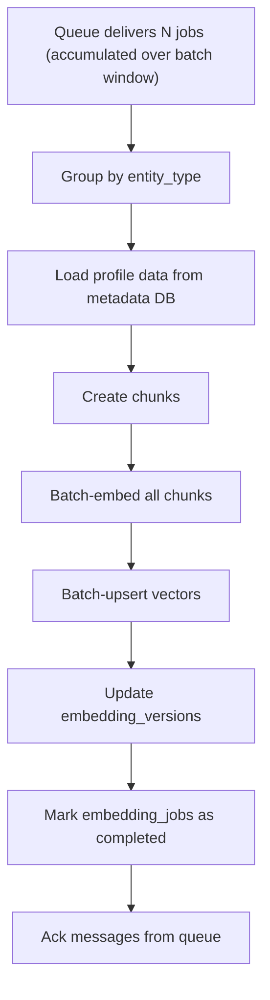

# TICKET-004: Profile Batch Worker

## Phase

**Phase 1 — Data Model and Profile Indexing Pipeline**  
Ref: `implementation-plan.md §7 Phase 1` — "Implement `profileBatchWorker` and profile indexing flow."

## Assignment Reference

- **assigment.md — Context (Phase 1):** The pipeline should "utilize LLM where it adds value." Embedding generation is a key LLM-adjacent operation that enables semantic retrieval.
- **implementation-plan.md §2 — Concurrency Plan:** `profileBatchWorker` is one of the two named workers. Batch processing with idempotency keys.
- **implementation-plan.md §4 — Data Freshness:** "Re-embed affected entity after each material change. Track `embedding_version`."

## Design Document References

- [architecture.md — §4 — Profile Batch Worker](../architecture.md): "Collects uploaded profiles. Chunks and embeds in batch windows."
- [ai-pipeline.md — §3.1 Teacher Upload Flow](../ai-pipeline.md): profileBatchWorker -> Chunking Service -> Embedding Service -> Vector Store.
- [ai-pipeline.md — §3.2 Student Upload Flow](../ai-pipeline.md): profileBatchWorker -> Normalization -> Embedding -> Vector Store.
- [data-model.md — §2.2 RAG Indexing Entities](../data-model.md): `profile_chunks`, `embedding_jobs`, `embedding_versions` tables.
- [data-model.md — §3 Vector Model](../data-model.md): Vector table schema with `vector_id`, `entity_type`, `embedding`, metadata.
- [technical-proposal.md — §10.5 profileBatchWorker](../technical-proposal.md): Batches chunk+embedding jobs on 30-90 second windows.

## Description

Implement the `profileBatchWorker` that consumes profile indexing jobs from the queue, creates semantic text chunks from teacher and student profiles, generates embeddings via an embedding API, and upserts the resulting vectors into pgvector.

This worker is the bridge between raw profile data and the vector store that powers semantic retrieval (TICKET-006).

## Acceptance Criteria

- [ ] Worker subscribes to the profile indexing queue and processes jobs in configurable batch windows (default: 30 seconds, max batch size: 20).
- [ ] For teacher profiles:
  - Creates text chunks from `bio`, `subjects`, `teaching_style`, `scores`, and `experience_years`.
  - Each chunk is stored in `profile_chunks` with `entity_type='teacher'`, `entity_id`, `profile_version`.
- [ ] For student profiles:
  - Creates text chunks from `learning_goals`, `weak_areas`, `current_level`, `preferred_learning_style`.
  - Each chunk is stored in `profile_chunks` with `entity_type='student'`.
- [ ] Chunks are sent to the embedding API in batch (not one-by-one).
- [ ] Resulting vectors are upserted into the pgvector table with metadata filters (`subjects`, `teaching_style`, `language`, `is_active`).
- [ ] `embedding_versions` table is updated with the current embedding model version for each entity.
- [ ] Stale vectors from previous profile versions are retired (soft delete or replaced).
- [ ] Worker is idempotent: reprocessing the same job (same `entity_id` + `profile_version`) does not create duplicate chunks or vectors.
- [ ] `embedding_jobs` status transitions: `queued` -> `processing` -> `completed` or `failed`.
- [ ] Failed jobs are retried up to 3 times with exponential backoff, then routed to DLQ.
- [ ] Batch processing throughput: at least 50 profiles per minute at baseline.
- [ ] Worker logs processing metrics: batch size, embedding latency, upsert count, error count.

## Technical Details

### Chunking Strategy

Each profile is split into semantic chunks for better retrieval granularity:

**Teacher chunks (3-5 chunks per teacher):**
1. **Identity chunk:** `"{name} is a {teaching_style} teacher with {experience_years} years of experience."`
2. **Subject chunk:** `"Teaches: {subjects joined}. Preferred student levels: {levels joined}."`
3. **Scores chunk:** `"Skill scores — subject_knowledge: {score}, communication: {score}, problem_solving: {score}, patience: {score}. Student satisfaction: {rating}/5."`
4. **Bio chunk:** Full `bio` text.
5. **Composite chunk:** All fields concatenated for broad retrieval.

**Student chunks (2-3 chunks per student):**
1. **Goals chunk:** `"{name} wants to: {learning_goals joined}. Current level: {level}. Preferred style: {style}."`
2. **Weak areas chunk:** `"Weak areas: {weak_areas joined}."`
3. **Composite chunk:** All fields concatenated.

### Vector ID Convention

Deterministic vector IDs for idempotent upsert:
```
{entity_type}:{entity_id}:chunk:{chunk_index}:v{profile_version}
```
Example: `teacher:T001:chunk:03:v2`

### Embedding API Call

```typescript
const embeddings = await embeddingClient.embedBatch(
  chunks.map(c => c.text),
  { model: process.env.EMBEDDING_MODEL }
);
```

### pgvector Upsert

```sql
INSERT INTO vectors (vector_id, entity_type, entity_id, chunk_id, embedding, embedding_version, metadata, updated_at)
VALUES ($1, $2, $3, $4, $5, $6, $7, now())
ON CONFLICT (vector_id) DO UPDATE SET
  embedding = EXCLUDED.embedding,
  embedding_version = EXCLUDED.embedding_version,
  metadata = EXCLUDED.metadata,
  updated_at = now();
```

### Batch Processing Flow



## Dependencies

- **TICKET-000** — Repo structure, `packages/workers` scaffold, Docker Compose (queue service).
- **TICKET-001** — Database schema (tables: `profile_chunks`, `embedding_jobs`, `embedding_versions`, vector table).
- **TICKET-002** — Teacher data must be ingested (provides teacher rows to chunk).
- **TICKET-003** — Student data must be ingested (provides student rows to chunk).

## Test Plan

### Unit Tests
- **Teacher chunking:** Pass T001 profile to chunking service; verify 4-5 chunks produced (identity, subject, scores, bio, composite). Verify each chunk contains expected text fragments.
- **Student chunking:** Pass S002 profile to chunking service; verify 2-3 chunks produced (goals, weak areas, composite).
- **Embedding mock:** Mock the embedding API; verify `embedBatch()` is called once per batch (not per chunk). Verify returned vectors have correct dimension (1536).
- **Vector ID generation:** Verify `teacher:T001:chunk:03:v1` format is produced. Verify version changes produce different IDs.
- **Idempotency dedup:** Process the same job twice (same `entity_id` + `profile_version`); verify second run produces no new chunks or vectors.
- **Batch windowing:** Enqueue 5 jobs within the window; verify they are processed as a single batch. Enqueue 25 jobs; verify they are split into batches respecting max batch size.

### Integration Tests
- **Worker job consumption:** Enqueue a profile indexing job for T001; verify worker picks it up, writes chunks to `profile_chunks`, calls embedding service, and upserts vectors to pgvector.
- **embedding_versions update:** After processing T001, query `embedding_versions` for `entity_type='teacher', entity_id='T001'`; verify the row exists with the correct model version.
- **Stale vector retirement:** Process T001 at `profile_version=1`, then process again at `profile_version=2`; verify old vectors are replaced/retired and new vectors have `v2` in their IDs.
- **embedding_jobs status transitions:** Enqueue a job; verify it transitions from `queued` -> `processing` -> `completed`. Simulate embedding API failure; verify status transitions to `failed`.
- **Retry + DLQ:** Simulate 3 consecutive embedding API failures for a job; verify exponential backoff delays (1s, ~4s, ~16s) and then the job is routed to DLQ.

### E2E / Manual Tests
- **Full teacher indexing:** Ingest all 10 teachers (via TICKET-002), wait for the batch window to complete, then query pgvector: verify all 10 teachers have vectors with `entity_type='teacher'` metadata. Expect approximately 40-50 vectors total.
- **Full student indexing:** Ingest all 3 students, wait for batch window; verify approximately 6-9 student vectors in pgvector.
- **Idempotency e2e:** Re-run the same batch of teacher indexing jobs; verify no duplicate vectors are created (total count unchanged).
- **Throughput check:** Ingest 50+ profiles in rapid succession; verify the worker processes at least 50 per minute.

### Requirement Coverage Matrix
| Acceptance Criterion | Test Type | Test Description |
|---|---|---|
| AC: Worker processes jobs in batch windows | Unit | Batch windowing test |
| AC: Teacher chunks created correctly | Unit | Teacher chunking test |
| AC: Student chunks created correctly | Unit | Student chunking test |
| AC: Chunks sent to embedding API in batch | Unit | Embedding mock — single batch call |
| AC: Vectors upserted with metadata filters | Integration | Worker job consumption |
| AC: embedding_versions updated | Integration | embedding_versions update check |
| AC: Stale vectors retired | Integration | Stale vector retirement test |
| AC: Idempotent reprocessing | Unit + E2E | Idempotency dedup + idempotency e2e |
| AC: embedding_jobs status transitions | Integration | Status transition verification |
| AC: Failed jobs retried then DLQ | Integration | Retry + DLQ test |
| AC: 50 profiles/min throughput | E2E | Throughput check |

## Dataset References

- Indirectly uses `dataset/teachers.json` and `dataset/new_students.json` — the worker processes the profiles that were ingested via TICKET-002 and TICKET-003. The 10 teachers will produce approximately 40-50 chunks and vectors. The 3 students will produce approximately 6-9 chunks.
