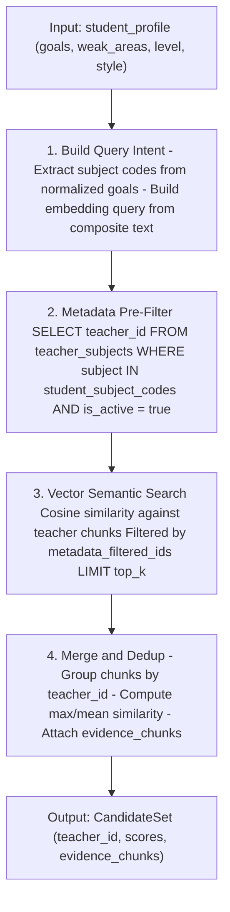

# TICKET-006: Hybrid Retrieval

## Phase

**Phase 2 — Retrieval and Ranking Pipeline**  
Ref: `implementation-plan.md §7 Phase 2` — "Implement recommendation trigger worker and RAG retrieval/ranking."

## Assignment Reference

- **assigment.md — Context (Phase 1):** "Automatically find the best-match teacher, plus 3 alternatives" — retrieval is the first step in finding candidates.
- **assigment.md — Goal:** "The pipeline should utilize LLM where it adds value" — vector-based semantic search is the LLM-adjacent retrieval mechanism.
- **implementation-plan.md §3 — External API Constraints:** Burst limits on embedding endpoints affect retrieval query encoding.

## Design Document References

- [ai-pipeline.md — §2 End-to-End Pipeline Flow](../ai-pipeline.md): `ToolCallAgent` -> `Hybrid Retriever (metadata + vector)` -> `Deterministic Score Engine`.
- [ai-pipeline.md — §5.1 Recommendation Runtime Contract](../ai-pipeline.md): Step 2 — "ToolCallAgent retrieves evidence candidates using approved tools only."
- [ai-pipeline.md — §5.2 ToolCallAgent Responsibilities](../ai-pipeline.md): "Retrieval planning: chooses the right mix of metadata filters, vector queries, and optional web queries."
- [technical-proposal.md — §5 Retrieval, Ranking, and Explanation Pipeline](../technical-proposal.md): Steps 1-3 — build query intent, run hybrid retrieval, merge and deduplicate.
- [architecture.md — §4 — RAG Orchestrator](../architecture.md): "Hybrid retrieval, scoring, reranking, and explanation assembly."
- [data-model.md — §3 Vector Model](../data-model.md): Vector table with filterable metadata.

## Description

Implement the hybrid retrieval module within the RAG Orchestrator (Python FastAPI service). This module combines metadata filtering with vector semantic search to produce a candidate set of teachers for a given student request.

The hybrid approach ensures:
1. **Metadata filters** enforce hard constraints (subject match, student level compatibility, teacher active status).
2. **Vector search** captures semantic similarity between student goals/weak areas and teacher profiles.
3. **Merge and dedup** produces a unified candidate list with evidence snippets attached.

## Acceptance Criteria

- [ ] A `retrieve_candidates(student_profile, config)` function returns a ranked list of candidate teachers with relevance scores and evidence chunks.
- [ ] Metadata pre-filtering narrows the teacher pool before vector search:
  - Filter by subject overlap between student goals and teacher subjects.
  - Filter by `preferred_student_level` containing student's `current_level`.
  - Filter by `is_active = true`.
- [ ] Vector search runs a semantic similarity query using the student's composite embedding against teacher chunk embeddings in pgvector.
- [ ] Results from metadata filter and vector search are merged, deduplicated by `teacher_id`, and scored.
- [ ] Each candidate in the result includes:
  - `teacher_id`
  - `metadata_match_score` (0-1, based on filter overlap)
  - `semantic_similarity_score` (0-1, from vector cosine similarity)
  - `combined_retrieval_score`
  - `evidence_chunks[]` (the specific chunks that matched)
- [ ] Retrieval returns at least `top_k=20` candidates (configurable) to feed into the scoring engine.
- [ ] If fewer than 4 candidates pass metadata filters, the filter is relaxed progressively (drop level constraint first, then widen subject match).
- [ ] Query embedding is generated once per student request and cached for the request lifecycle.
- [ ] Retrieval latency is under 500ms for a 100-teacher corpus with pgvector HNSW index.

## Technical Details

### Hybrid Retrieval Flow



### Query Intent Builder

```python
def build_query_intent(student: StudentProfile) -> QueryIntent:
    subject_codes = [sg.subject.code for sg in student.goal_subjects]
    query_text = f"""
    Student needs help with: {', '.join(student.learning_goals_raw)}.
    Weak areas: {', '.join(student.weak_areas_raw)}.
    Level: {student.current_level}. Style: {student.preferred_learning_style}.
    """
    query_embedding = embedding_client.embed(query_text)
    return QueryIntent(subject_codes, query_text, query_embedding)
```

### pgvector Similarity Query

Uses cosine distance operator `<=>`:

```sql
SELECT entity_id, chunk_id, metadata,
       1 - (embedding <=> $1) AS cosine_similarity
FROM vectors
WHERE entity_type = 'teacher'
  AND entity_id = ANY($2)
ORDER BY embedding <=> $1
LIMIT $3;
```

### Progressive Filter Relaxation

If strict filters return fewer than 4 candidates:
1. Drop `preferred_student_level` constraint.
2. Expand subject match to include adjacent subjects (e.g., Physics for a Math student).
3. Include inactive teachers with a penalty flag.

## Dependencies

- **TICKET-001** — Database schema (vector table with pgvector index).
- **TICKET-004** — Profile Batch Worker must have generated teacher embeddings.
- **TICKET-005** — Subject taxonomy for metadata filter subject codes.

## Test Plan

### Unit Tests
- **Query intent builder:** Pass S002 profile (Math/Physics goals, beginner, structured); verify `subject_codes` contains `['math', 'physics']` and `query_text` includes learning goals and weak areas.
- **Metadata filter SQL:** Verify filter builder generates correct SQL/parameters for `subject=math, level=beginner, is_active=true`. Verify it excludes inactive teachers.
- **Vector search mock:** Mock pgvector query; verify results are sorted by cosine similarity descending. Verify `top_k` limit is respected.
- **Merge/dedup logic:** Provide 6 chunks from 3 teachers (2 chunks each); verify dedup produces 3 candidates. Verify `max_similarity` and `mean_similarity` are computed correctly per teacher.
- **Progressive filter relaxation:** When strict filters return 2 candidates (below threshold of 4), verify relaxation drops `preferred_student_level` first, then widens subject match.

### Integration Tests
- **S002 retrieval (Math/Physics beginner):** With all 10 teachers indexed, run `retrieve_candidates(S002)`; verify candidate set includes T001 (Math+Physics, structured, beginner-friendly) and excludes T006 (Programming only, advanced only). Verify T009 (English only) is excluded by subject filter.
- **S004 retrieval (Japanese/History):** Run `retrieve_candidates(S004)`; verify metadata filter returns zero direct matches, progressive relaxation kicks in, and result set contains teachers ranked by general semantic similarity.
- **Evidence chunks attached:** For S002 retrieval, verify each candidate has at least one `evidence_chunk` from the vector search results.
- **Retrieval latency:** Measure retrieval time for S002 against the 10-teacher corpus; verify under 500ms with pgvector HNSW index.

### E2E / Manual Tests
- **All 3 students retrieval:** Run the full retrieval pipeline for S002, S003, and S004. Verify:
  - S002 returns candidates covering Math and Physics teachers.
  - S003 returns candidates covering Programming and Math teachers.
  - S004 returns a relaxed candidate set with low confidence scores.
- **Inspect evidence quality:** For S002's top candidate, read the attached `evidence_chunks`; verify they contain relevant teacher profile text (subjects, bio, scores).

### Requirement Coverage Matrix
| Acceptance Criterion | Test Type | Test Description |
|---|---|---|
| AC: retrieve_candidates returns ranked list with scores and chunks | Integration | S002 retrieval test |
| AC: Metadata pre-filter by subject, level, is_active | Unit + Integration | Metadata filter SQL + S002 retrieval |
| AC: Vector semantic search via pgvector | Unit | Vector search mock |
| AC: Merge and dedup by teacher_id | Unit | Merge/dedup logic test |
| AC: Each candidate includes scores + evidence_chunks | Integration | Evidence chunks attached |
| AC: Returns top_k=20 candidates | Unit | Vector search mock — top_k limit |
| AC: Progressive filter relaxation when < 4 candidates | Unit + Integration | Filter relaxation + S004 retrieval |
| AC: Query embedding cached per request | Unit | Query intent builder (single embed call) |
| AC: Latency under 500ms | Integration | Retrieval latency check |

## Dataset References

- Uses embeddings generated from `dataset/teachers.json` profiles (via TICKET-004).
- Query intent is built from `dataset/new_students.json` student profiles.
- For S002 (Math/Physics beginner): metadata filter should return T001 (Math, Physics), T004 (Physics, Chemistry), T005 (English, Math), T007 (Math, Chemistry), T008 (Physics, Programming), T010 (Chemistry, Math) — then vector search refines by semantic relevance.
- For S004 (Japanese/History): metadata filter returns zero teachers — progressive relaxation should broaden to all active teachers and rank by general semantic similarity.
