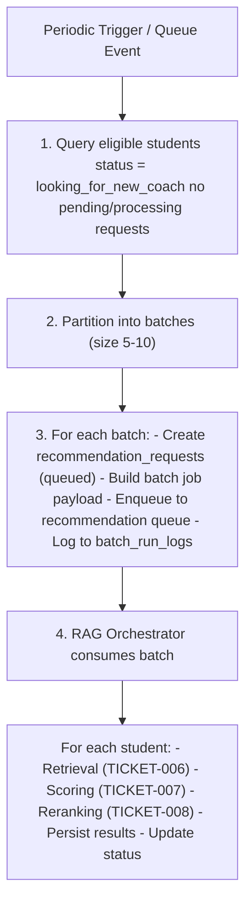

# TICKET-009: Recommendation Batch Worker

## Phase

**Phase 2 — Retrieval and Ranking Pipeline**  
Ref: `implementation-plan.md §7 Phase 2` — "Implement recommendation trigger worker and RAG retrieval/ranking."

## Assignment Reference

- **assigment.md — Context (Phase 2):** "The UI triggers the pipeline via the API, but the pipeline runs in the background." The recommendation batch worker is the background execution mechanism.
- **implementation-plan.md §2 — Concurrency Plan:** "`recommendationBatchWorker` for recommendation triggers. Batch recommendation jobs in size 5-10."
- **implementation-plan.md §2 — Capacity Controls:** "Autoscale workers based on queue depth. Separate queues for indexing and recommendation. Enforce idempotency keys."
- **implementation-plan.md §2 — Failure Handling:** "Retry transient failures with exponential backoff. Route hard failures to DLQ."

## Design Document References

- [architecture.md — §4 — Recommendation Batch Worker](../architecture.md): "Picks eligible students (`looking_for_new_coach`). Dispatches recommendation jobs in batch size 5-10. Writes outputs with idempotent upsert."
- [ai-pipeline.md — §4 Recommendation Batch Trigger Flow](../ai-pipeline.md): Sequence diagram — scheduler -> worker -> metaDB -> queue -> RAG Orchestrator.
- [technical-proposal.md — §4.3 Recommendation Trigger](../technical-proposal.md): Full sequence chart for batch trigger flow.
- [technical-proposal.md — §10.5 recommendationBatchWorker](../technical-proposal.md): "Periodically queries students where status=looking_for_new_coach. Applies backpressure based on queue depth and LLM latency."
- [data-model.md — §2.3 Recommendation Entities](../data-model.md): `recommendation_requests`, `recommendation_results` tables.

## Description

Implement the `recommendationBatchWorker` that periodically scans for students awaiting recommendations, batches them, and dispatches recommendation jobs to the RAG Orchestrator. This worker is the orchestration bridge between student registration and the AI recommendation pipeline.

## Acceptance Criteria

- [ ] Worker runs on a configurable schedule (default: every 30 seconds) or is triggered by queue events.
- [ ] Queries the `students` table for records with `status = 'looking_for_new_coach'` that do not already have a pending or processing `recommendation_requests` entry.
- [ ] Groups eligible students into batches of configurable size (default: 5, max: 10).
- [ ] For each batch:
  - Creates `recommendation_requests` rows with `status = 'queued'` for each student.
  - Enqueues a batch recommendation job to the recommendation queue.
- [ ] Status transitions follow the state machine: `queued` -> `processing` -> `completed` | `failed` | `hitl_review`.
- [ ] Workers are idempotent: if the same student already has a `queued` or `processing` request, a new request is not created.
- [ ] Failed recommendation jobs are retried up to 3 times with exponential backoff (1s, 4s, 16s).
- [ ] Jobs that fail all retries are routed to the DLQ.
- [ ] `batch_run_logs` table records each batch run with `worker_name`, `batch_size`, `status`, `started_at`, `completed_at`.
- [ ] Worker logs: eligible student count, batch count, dispatch latency, error count.
- [ ] Under load (100+ eligible students), worker dispatches batches without blocking and respects queue backpressure signals.
- [ ] **Autoscaling triggers are implemented:** scale up when recommendation queue depth > `50` or worker P95 processing latency > `5s`; scale down after `5` consecutive minutes of empty queue.
- [ ] **Worker scaling guardrail:** recommendation worker count is capped at `10` instances to stay within LLM provider limits.
- [ ] **Capacity target validation:** with batch size `10`, `3` workers sustain ~`75` students/min and drain `1,000` queued students in ~`14` minutes (allowing test-environment tolerance).

## Technical Details

### Batch Scan Query

```sql
SELECT s.student_id
FROM students s
WHERE s.status = 'looking_for_new_coach'
  AND NOT EXISTS (
    SELECT 1 FROM recommendation_requests rr
    WHERE rr.student_id = s.student_id
      AND rr.status IN ('queued', 'processing')
  )
ORDER BY s.created_at ASC
LIMIT :max_batch_scan;
```

### Batch Dispatch Flow



### Backpressure Strategy

```typescript
async function dispatchBatch(batch: StudentBatch): Promise<void> {
  const queueDepth = await queue.getApproximateMessageCount();
  
  if (queueDepth > config.maxQueueDepth) {
    logger.warn(`Queue depth ${queueDepth} exceeds threshold. Reducing batch size.`);
    // Reduce batch size or delay dispatch
    await sleep(config.backpressureDelayMs);
  }
  
  await queue.send({
    batchId: batch.id,
    studentIds: batch.studentIds,
    profileVersions: batch.profileVersions,
    idempotencyKey: `rec:${batch.id}`
  });
}
```

### Idempotency

- Each `recommendation_request` has a unique constraint on `(student_id, status)` for active states.
- Queue messages carry an idempotency key `rec:batch_{batch_id}`.
- The RAG Orchestrator checks for existing completed results before processing.

### Retry Policy

```typescript
const retryPolicy = {
  maxRetries: 3,
  backoffMultiplier: 4,
  initialDelayMs: 1000,
  // Retries at: 1s, 4s, 16s
  maxDelayMs: 60000,
  retryableErrors: ['TIMEOUT', 'LLM_RATE_LIMIT', 'DB_TRANSIENT']
};
```

## Dependencies

- **TICKET-000** — Repo structure, `packages/workers` scaffold, queue infrastructure.
- **TICKET-001** — Database schema (`recommendation_requests`, `recommendation_results`, `batch_run_logs`).
- **TICKET-003** — Students must be ingested with `status = 'looking_for_new_coach'`.
- **TICKET-006** — Hybrid Retrieval (consumed by the RAG Orchestrator when processing dispatched jobs).
- **TICKET-007** — Deterministic Scoring Engine (consumed during job processing).
- **TICKET-008** — LLM Reranker (consumed during job processing).

## Test Plan

### Unit Tests
- **Batch partitioning — small set:** Pass 3 eligible students; verify a single batch of size 3 is created.
- **Batch partitioning — large set:** Pass 12 eligible students with max batch size 10; verify 2 batches are created (e.g., 10+2 or 7+5 depending on strategy).
- **Batch partitioning — empty set:** Pass 0 eligible students; verify no batches are created and no jobs enqueued.
- **Scan query correctness:** Verify the scan query filters `status = 'looking_for_new_coach'` AND excludes students with existing `queued` or `processing` requests.
- **Idempotency — duplicate prevention:** Mark S002 as having a `queued` request; run scan; verify S002 is excluded from the batch.
- **Schedule timing:** Verify worker runs on configurable schedule (mock timer fires every 30s by default).

### Integration Tests
- **Batch scan + enqueue:** Insert 3 students with `status = 'looking_for_new_coach'` and no existing requests; trigger batch scan; verify 1 batch job is enqueued with all 3 student IDs. Verify 3 `recommendation_requests` rows created with `status = 'queued'`.
- **Status transitions:** After RAG Orchestrator processes a batch, verify `recommendation_requests.status` transitions from `queued` -> `processing` -> `completed`.
- **batch_run_logs:** After a batch run, query `batch_run_logs`; verify a row exists with `worker_name = 'recommendationBatchWorker'`, correct `batch_size`, and `status = 'completed'`.
- **Retry + DLQ:** Simulate 3 consecutive failures for a recommendation job; verify exponential backoff (1s, 4s, 16s) and then routing to DLQ.
- **Backpressure:** Set `maxQueueDepth` to a low value, fill the queue, then trigger batch scan; verify worker delays or reduces batch size.
- **Scale-up trigger:** Simulate queue depth > 50; verify autoscaler requests additional worker instances (up to configured max).
- **Latency trigger:** Inject processing delay to breach P95 > 5s; verify autoscaler requests scale-up.
- **Scale-down trigger:** Keep queue empty for 5 consecutive minutes; verify autoscaler scales recommendation workers down.

### E2E / Manual Tests
- **Full recommendation cycle:** Ingest 3 students from `new_students.json`, ensure teachers are indexed, trigger the batch worker; wait for RAG Orchestrator to complete. Verify all 3 `recommendation_requests` reach `status = 'completed'` with corresponding `recommendation_results` rows.
- **Scale test (100 students):** Generate 100 synthetic students with `status = 'looking_for_new_coach'`; trigger worker; verify batches of 5-10 are created and dispatched without blocking. Monitor `batch_run_logs` for all batches.
- **Scale test (1,000 students):** Generate 1,000 synthetic students; run with 3 workers and batch size 10; verify queue drains in approximately 14 minutes (+/- environment variance), or document measured throughput and deviation.

### Requirement Coverage Matrix
| Acceptance Criterion | Test Type | Test Description |
|---|---|---|
| AC: Worker runs on configurable schedule | Unit | Schedule timing test |
| AC: Queries students with looking_for_new_coach | Unit + Integration | Scan query + Batch scan+enqueue |
| AC: Groups into batches of 5-10 | Unit | Batch partitioning tests |
| AC: Creates recommendation_requests (queued) | Integration | Batch scan+enqueue — row creation |
| AC: Status machine: queued->processing->completed | Integration | Status transitions test |
| AC: Idempotent — no duplicate requests | Unit | Idempotency — duplicate prevention |
| AC: Retry with exponential backoff | Integration | Retry + DLQ test |
| AC: Failed jobs to DLQ after 3 retries | Integration | Retry + DLQ test |
| AC: batch_run_logs recorded | Integration | batch_run_logs verification |
| AC: Handles 100+ students without blocking | E2E | Scale test (100 students) |
| AC: Autoscaling triggers based on depth/latency | Integration | Scale-up + latency trigger tests |
| AC: Scale-down after sustained empty queue | Integration | Scale-down trigger test |
| AC: Worker cap at 10 instances | Integration | Scale-up trigger with max cap enforcement |
| AC: Capacity target for 1,000 queue drain | E2E | Scale test (1,000 students) |

## Dataset References

- The worker scans for students from `dataset/new_students.json` (S002, S003, S004), all initially seeded with `status = 'looking_for_new_coach'`.
- With 3 students, a single batch (size 3-5) will be created.
- At scale (100-1000 students per the implementation plan), the worker creates 10-200 batches per scan cycle.
