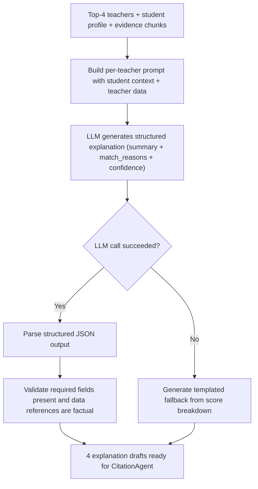

# TICKET-010: Explanation Generator

## Phase

**Phase 3 — Multi-Agent Explanation and Citation Validation**  
Ref: `implementation-plan.md §7 Phase 3` — "Add explanation generation and citation validation agents."

## Assignment Reference

- **assigment.md — Deliverables — `output.md`:** "Explanations — one LLM-generated explanation per selected teacher, tied to specific student and teacher data."
- **assigment.md — Context (Phase 1):** "The pipeline should utilize LLM where it adds value." Explanation generation is a primary LLM value-add.

## Design Document References

- [ai-pipeline.md — §2 End-to-End Pipeline Flow](../ai-pipeline.md): `Explanation Generator` sits between `Select top 4` and `CitationAgent`.
- [ai-pipeline.md — §5.1 Recommendation Runtime Contract](../ai-pipeline.md): Step 4 — "Explanation generator drafts teacher-specific reasoning."
- [architecture.md — §6 Output Contract](../architecture.md): Each selected teacher must include an `explanation` with `summary` and `match_reasons`.
- [technical-proposal.md — §5 Step 7](../technical-proposal.md): "Generate explanation drafts."

## Description

Implement the explanation generation module that produces a personalized, LLM-generated explanation for each of the top-4 selected teachers. Each explanation must reference specific student needs and teacher attributes, producing structured output with a `summary` and `match_reasons` array.

The explanation drafts are then passed to the CitationAgent (TICKET-011) for evidence validation before reaching the final output.

## Acceptance Criteria

- [ ] `generate_explanations(student, top_4_teachers[], evidence_chunks[])` returns one explanation per teacher.
- [ ] Each explanation contains:
  - `summary`: A 1-2 sentence overview of why this teacher is a good match.
  - `match_reasons`: An array of 2-4 specific reasons tied to student and teacher data.
  - `confidence`: `high`, `medium`, or `low` based on evidence strength.
- [ ] The LLM prompt includes student-specific context (goals, weak areas, level, style) and teacher-specific data (subjects, scores, bio, teaching style, experience).
- [ ] Explanations reference actual data points (e.g., "Math score of 92" not "high math score").
- [ ] Empty or missing `bio` fields are handled gracefully without errors or hallucinated content.
- [ ] Structured output parsing extracts the expected JSON schema from LLM response.
- [ ] If LLM fails, a templated fallback explanation is generated from the deterministic score breakdown.
- [ ] A `pipeline_trace_steps` entry records `step_name='explanation_generation'` with prompt, model, latency, and token usage.
- [ ] Generation latency P95 is under 4 seconds for 4 explanations.

## Technical Details

### Explanation Generation Flow



### Prompt Design

For each teacher, the prompt includes:

```
You are an expert education consultant. Explain why this teacher is a good match
for this student. Be specific — reference actual data points.

STUDENT:
- Goals: {learning_goals}
- Weak areas: {weak_areas}
- Level: {current_level}
- Preferred style: {preferred_learning_style}

TEACHER:
- Name: {name}
- Subjects: {subjects}
- Teaching style: {teaching_style}
- Experience: {experience_years} years
- Bio: {bio}
- Skill scores: {scores}
- Rank: {rank} of 4 (deterministic score: {score})

Return JSON:
{
  "summary": "1-2 sentence overview",
  "match_reasons": ["reason 1 with data", "reason 2 with data", ...],
  "confidence": "high|medium|low"
}
```

### LLM Call Configuration

```python
explanation = await llm_client.chat(
    model=config.llm_model,
    messages=[system_prompt, user_prompt],
    response_format={"type": "json_object"},
    temperature=0.3,
    max_tokens=500,
    timeout=5.0
)
```

### Fallback Template

When LLM is unavailable, generate from score breakdown:

```python
def generate_fallback_explanation(student, teacher, score_breakdown):
    reasons = []
    if score_breakdown.skill_gap_coverage > 0.7:
        reasons.append(f"Strong subject coverage in {', '.join(overlap_subjects)}")
    if score_breakdown.teaching_style_fit == 1.0:
        reasons.append(f"Teaching style ({teacher.teaching_style}) matches preference")
    # ... additional rules
    return Explanation(
        summary=f"{teacher.name} scored {score_breakdown.total:.2f} for your profile.",
        match_reasons=reasons,
        confidence="medium"
    )
```

## Dependencies

- **TICKET-007** — Deterministic Scoring Engine provides score breakdowns.
- **TICKET-008** — LLM Reranker provides the top-4 selection.
- **TICKET-006** — Evidence chunks from retrieval are included in prompts.
- **TICKET-001** — Database schema (`recommendation_explanations`, `pipeline_trace_steps`).

## Test Plan

### Unit Tests
- **Prompt construction — full data:** Build prompt for T001 vs S002; verify prompt includes S002's goals ("Understand core Math concepts", "Build confidence in Physics"), weak areas ("Algebra", "Geometry", "Newton's Laws"), and T001's scores (subject_knowledge: 92, communication: 85).
- **Prompt construction — empty bio:** Build prompt for a teacher with `bio: null`; verify no error and bio section is omitted or says "No bio available."
- **Structured output parsing:** Mock LLM returning valid JSON with `summary`, `match_reasons`, `confidence`; verify parser extracts all fields.
- **Structured output — malformed response:** Mock LLM returning plain text instead of JSON; verify graceful handling (fallback or retry).
- **Fallback template generation:** Given T001 score breakdown with `skill_gap_coverage=0.95, teaching_style_fit=1.0`; verify fallback produces a meaningful explanation with at least 2 reasons.
- **Confidence assignment:** Verify `high` is assigned when all evidence is strong, `medium` when some gaps exist, `low` when evidence is sparse.

### Integration Tests
- **Full explanation generation for S002:** Pass S002's top-4 teachers and evidence chunks; generate 4 explanations; verify each explanation references S002's actual weak areas and each teacher's actual scores (not hallucinated data).
- **Trace output:** After generation, query `pipeline_trace_steps` for `step_name='explanation_generation'`; verify the entry includes model, latency, and token count.
- **Explanation persistence:** Verify each explanation is written to `recommendation_explanations` with correct `result_id` and `llm_model`.
- **LLM failure fallback integration:** Block LLM endpoint; run explanation generation; verify 4 fallback explanations are produced from score breakdowns.

### E2E / Manual Tests
- **Factual consistency check for S002:** Read generated explanations for S002's top-1 match; manually compare each data point mentioned (e.g., "Math score of 92") against `teachers.json`; verify no hallucinated subjects, scores, or experience years.
- **Explanation quality review:** Read all 4 explanations for S002; verify each is distinct, references different aspects of the teacher, and reads naturally.

### Requirement Coverage Matrix
| Acceptance Criterion | Test Type | Test Description |
|---|---|---|
| AC: Returns one explanation per teacher | Integration | Full explanation generation for S002 |
| AC: Each has summary + match_reasons + confidence | Unit | Structured output parsing |
| AC: Prompt includes student and teacher context | Unit | Prompt construction — full data |
| AC: References actual data points | E2E/Manual | Factual consistency check |
| AC: Handles empty bio gracefully | Unit | Prompt construction — empty bio |
| AC: Structured output parsing works | Unit | Parsing + malformed response tests |
| AC: Fallback when LLM fails | Unit + Integration | Fallback template + LLM failure integration |
| AC: Trace entry written | Integration | Trace output verification |
| AC: P95 latency under 4s | Integration | Timing check during full generation |

## Dataset References

- Teacher data from `dataset/teachers.json` is included in explanation prompts. Example: T001's bio "Specialises in breaking down complex Math and Physics concepts step by step" should appear in the prompt and may be referenced in the explanation.
- Student data from `dataset/new_students.json` drives the explanation context. S002's weak areas (Algebra, Geometry, Newton's Laws) should be directly addressed in the explanation.
