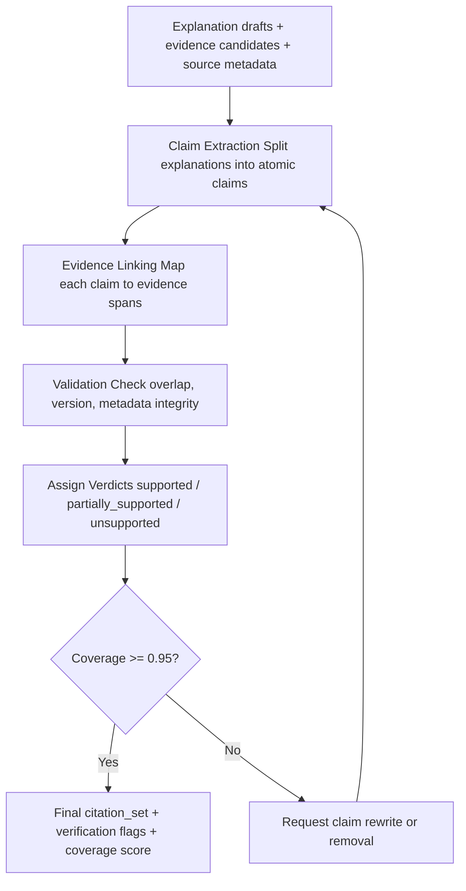

# TICKET-011: Citation Agent

## Phase

**Phase 3 — Multi-Agent Explanation and Citation Validation**  
Ref: `implementation-plan.md §7 Phase 3` — "Add explanation generation and citation validation agents."

## Assignment Reference

- **assigment.md — Deliverables — `output.md`:** "Explanations — one LLM-generated explanation per selected teacher, tied to specific student and teacher data." Citations ensure explanations are tied to actual data.
- **technical-proposal.md — §2 NFR-4:** "Explanation outputs must pass citation coverage >= 95% of claims."

## Design Document References

- [ai-pipeline.md — §5.3 CitationAgent Responsibilities](../ai-pipeline.md): Claim extraction, evidence linking, validation rules, coverage checks, output shaping.
- [ai-pipeline.md — §5.4 Agent Inputs and Outputs](../ai-pipeline.md): CitationAgent input (explanation draft + evidence candidates) and output (citation_set + verdicts + coverage score).
- [ai-pipeline.md — §5.5 Model Routing and Cost Optimization](../ai-pipeline.md): High-performance model tier reserved for high-ambiguity claim adjudication.
- [architecture.md — §6 Output Contract](../architecture.md): Each result must include `citations[]` with `source_type`, `source_id`, `field`.
- [data-model.md — §2.3 Recommendation Entities](../data-model.md): `recommendation_citations` table with `source_id`, `chunk_id`.

## Description

Implement the `CitationAgent` that validates every claim in an explanation against retrieved evidence. The agent extracts atomic claims, links each to source evidence, assigns support verdicts, and rejects unsupported claims. This ensures no hallucinated or unfounded statements reach the final output.

## Acceptance Criteria

- [ ] `validate_citations(explanation_drafts[], evidence_candidates[])` returns a `citation_set` per explanation.
- [ ] **Claim extraction:** Each explanation is split into atomic claims (e.g., "High Math score (92) aligns with Algebra weakness" becomes two claims: "Math score is 92" and "teacher aligns with Algebra weakness").
- [ ] **Evidence linking:** Each claim is mapped to one or more evidence spans from `profile_chunks` or `teacher_skill_scores`.
- [ ] **Support verdicts:** Each claim receives `supported`, `partially_supported`, or `unsupported` verdict.
- [ ] **Unsupported claim rejection:** Claims with `verdict=unsupported` are removed from the final explanation or flagged for rewrite.
- [ ] **Coverage score:** A `citation_completeness_score` (0-1) is computed per explanation. Must be >= 0.95 for high-confidence results.
- [ ] **Citation output shape:** Each citation includes `source_id`, `chunk_id`, `evidence_span`, `field`.
- [ ] **Rewrite request:** When coverage < threshold, the agent can request claim rewrite from the explanation generator.
- [ ] **Stale version rejection:** Citations referencing outdated `profile_version` or `embedding_version` are rejected.
- [ ] Results are persisted to `recommendation_citations` table.
- [ ] **Model tier routing:** Default claim extraction/linking uses deterministic rules or cheap/balanced model tier; escalate to high-performance model only for unresolved ambiguous claims.
- [ ] Citation trace records `model_tier`, `model_name`, token usage, and escalation reason when high-performance adjudication is used.

## Technical Details

### Citation Validation Flow



### Claim Extraction Logic

```python
def extract_claims(explanation: Explanation) -> list[Claim]:
    claims = []
    for reason in explanation.match_reasons:
        atomic = llm_extract_atomic_claims(reason)
        claims.extend(atomic)
    if explanation.summary:
        claims.extend(llm_extract_atomic_claims(explanation.summary))
    return claims
```

### Evidence Linking

```python
def link_evidence(claim: Claim, evidence: list[EvidenceChunk]) -> list[Citation]:
    citations = []
    for chunk in evidence:
        overlap = compute_semantic_overlap(claim.text, chunk.text)
        if overlap > config.min_overlap_threshold:
            citations.append(Citation(
                source_id=chunk.source_id,
                chunk_id=chunk.chunk_id,
                evidence_span=chunk.text[:200],
                overlap_score=overlap
            ))
    return citations
```

### Verdict Assignment

- `supported`: >= 1 citation with overlap > 0.8
- `partially_supported`: >= 1 citation with overlap 0.5-0.8
- `unsupported`: no citation with overlap > 0.5

## Dependencies

- **TICKET-010** — Explanation Generator provides explanation drafts.
- **TICKET-006** — Evidence chunks from retrieval.
- **TICKET-004** — Profile chunks with source metadata for citation linking.
- **TICKET-001** — Database schema (`recommendation_citations`, `profile_chunks`).

## Test Plan

### Unit Tests
- **Claim extraction — compound sentence:** Pass "High Math score (92) aligns with weak area Algebra"; verify 2 atomic claims extracted: "Math score is 92" and "aligns with Algebra weakness."
- **Claim extraction — simple sentence:** Pass "Teaching style matches preference"; verify 1 atomic claim.
- **Evidence linking — strong match:** Given claim "Math score is 92" and evidence chunk containing "subject_knowledge: 92"; verify citation is created with high overlap.
- **Evidence linking — no match:** Given claim "Best teacher in the country" and evidence chunks about scores; verify no citation produced.
- **Verdict assignment — supported:** Claim with overlap > 0.8; verify `verdict = 'supported'`.
- **Verdict assignment — unsupported:** Claim with no citation above 0.5; verify `verdict = 'unsupported'` and claim is flagged for removal.
- **Coverage score calculation:** 10 claims, 9 supported, 1 unsupported; verify `coverage_score = 0.9`.
- **Stale version rejection:** Citation referencing `profile_version=1` when current is `profile_version=2`; verify rejection.

### Integration Tests
- **Full citation validation for S002:** Pass S002's 4 explanation drafts and evidence chunks; verify each explanation receives a `citation_set`. Verify coverage >= 0.95 for well-matched teachers (T001). Verify each citation links to an actual `profile_chunks` row.
- **Unsupported claim removal:** Inject a hallucinated claim ("T001 has 20 years experience" when actual is 8); verify it receives `unsupported` verdict and is removed from the final explanation.
- **Rewrite loop:** Set coverage threshold to 0.99; pass an explanation with 1 weakly supported claim; verify the agent requests a rewrite and re-validates.
- **Persistence:** After validation, query `recommendation_citations` for the request; verify citation rows exist with correct `source_id`, `chunk_id`, and `evidence_span`.
- **Ambiguous claim escalation:** Provide claims with conflicting evidence spans and borderline overlap scores; verify high-performance model tier is used only for those unresolved claims, with escalation reason logged.

### E2E / Manual Tests
- **Full pipeline citation check for S002:** Run the complete pipeline (retrieval -> scoring -> reranking -> explanation -> citation); verify every claim in the final output has at least one citation. Verify no `unsupported` claims remain.
- **Citation accuracy manual review:** For S002's top-1 teacher, read each citation's `evidence_span`; verify it genuinely supports the linked claim (not a false positive).

### Requirement Coverage Matrix
| Acceptance Criterion | Test Type | Test Description |
|---|---|---|
| AC: Returns citation_set per explanation | Integration | Full citation validation for S002 |
| AC: Claim extraction splits atomic claims | Unit | Claim extraction tests |
| AC: Evidence linking maps to source | Unit | Evidence linking tests |
| AC: Verdicts: supported/partially/unsupported | Unit | Verdict assignment tests |
| AC: Unsupported claims rejected | Unit + Integration | Verdict + unsupported claim removal |
| AC: Coverage score >= 0.95 | Integration | Full validation — coverage check |
| AC: Citation shape includes source_id, chunk_id | Integration | Persistence test |
| AC: Rewrite request when coverage low | Integration | Rewrite loop test |
| AC: Stale version rejection | Unit | Stale version rejection test |
| AC: Persisted to recommendation_citations | Integration | Persistence test |
| AC: Tiered model usage in citation adjudication | Integration | Ambiguous claim escalation test |

## Dataset References

- Evidence chunks are derived from `dataset/teachers.json` profiles (via TICKET-004 embedding). T001's chunk containing "subject_knowledge: 92" is the expected evidence for claims about Math scores.
- Student data from `dataset/new_students.json` drives the claims. S002's weak areas (Algebra, Geometry, Newton's Laws) should be cited against teacher profiles.
