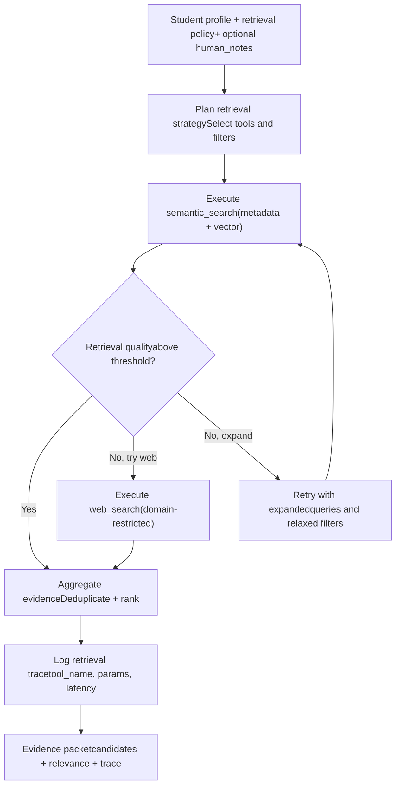

# TICKET-012: Tool Call Agent

## Phase

**Phase 3 — Multi-Agent Explanation and Citation Validation**  
Ref: `implementation-plan.md §7 Phase 3` — "Add explanation generation and citation validation agents."

## Assignment Reference

- **assigment.md — Context (Phase 1):** "The pipeline should utilize LLM where it adds value." The ToolCallAgent uses LLM to plan and execute retrieval strategies.
- **implementation-plan.md §3 — External API Constraints:** Circuit breaker and timeout policy around LLM and web search calls.

## Design Document References

- [ai-pipeline.md — §5 Multi-Agent AI Design — ToolCallAgent](../ai-pipeline.md): Tool-call-only policy, allowed tools (semantic_search, web_search), structured retrieval traces.
- [ai-pipeline.md — §5.2 ToolCallAgent Responsibilities](../ai-pipeline.md): Retrieval planning, evidence gathering, traceability, fallback strategy, safety guardrails.
- [ai-pipeline.md — §5.4 Agent Inputs and Outputs](../ai-pipeline.md): Input (student profile, retrieval policy, human_notes_version) and output (ranked evidence candidates, retrieval trace).
- [technical-proposal.md — §6 Multi-Agent AI Architecture — ToolCallAgent](../technical-proposal.md): Tool-call-only execution policy, allowed tools, structured evidence packets.

## Description

Implement the `ToolCallAgent` that operates under a strict tool-call-only policy to retrieve evidence for recommendation decisions. The agent plans which retrieval tools to use, executes them, and produces structured evidence packets — never generating free-form claims directly.

This agent is invoked by the OrchestratorAgent (TICKET-013) during each recommendation job.

## Acceptance Criteria

- [ ] `ToolCallAgent` uses only approved tools: `semantic_search`, `web_search`, and internal profile retrieval APIs.
- [ ] No free-form claims are generated — the agent outputs only structured evidence packets.
- [ ] **Retrieval planning:** Agent selects the right mix of metadata filters, vector queries, and optional web queries based on student profile.
- [ ] **Evidence gathering:** Returns candidate chunks from teacher profiles with relevance signals.
- [ ] **Traceability:** Every tool call is logged to `pipeline_trace_steps` with `tool_name`, request parameters, response hash, and latency.
- [ ] **Bounded execution:** Max tool calls is configurable (default: 10). Execution timeout is configurable (default: 15s).
- [ ] **Fallback strategy:** If retrieval quality is low (fewer than 4 candidates with similarity > threshold), agent retries with expanded queries and relaxed filters.
- [ ] **Domain allowlist:** `web_search` is restricted to approved domains only.
- [ ] `web_search` is only invoked when retrieval quality is below a configurable threshold.
- [ ] Output includes `evidence_candidates[]` with relevance scores and `retrieval_trace` for observability.

## Technical Details

### ToolCallAgent Execution Flow



### Tool Definitions

```python
tools = [
    {
        "name": "semantic_search",
        "description": "Search teacher profiles by semantic similarity",
        "parameters": {
            "query_text": "string",
            "subject_filter": "string[]",
            "level_filter": "string",
            "top_k": "int"
        }
    },
    {
        "name": "web_search",
        "description": "Search external sources for teacher credentials",
        "parameters": {
            "query": "string",
            "domain_allowlist": "string[]",
            "max_results": "int"
        }
    },
    {
        "name": "profile_lookup",
        "description": "Retrieve full teacher profile by ID",
        "parameters": {
            "teacher_id": "string"
        }
    }
]
```

### Trace Entry Format

```json
{
  "step_name": "tool_call_retrieval",
  "tool_calls": [
    {
      "tool_name": "semantic_search",
      "request": {"query_text": "...", "subject_filter": ["math"], "top_k": 20},
      "response_hash": "abc123",
      "result_count": 15,
      "latency_ms": 120
    }
  ],
  "total_tool_calls": 2,
  "total_latency_ms": 250
}
```

## Dependencies

- **TICKET-006** — Hybrid Retrieval module provides the `semantic_search` tool implementation.
- **TICKET-004** — Profile chunks with embeddings for vector search.
- **TICKET-000** — `services/ai` scaffold for Python LangGraph agent.
- **TICKET-001** — Database schema (`pipeline_trace_steps`).

## Test Plan

### Unit Tests
- **Tool selection — standard case:** Pass S002 profile (Math/Physics goals); verify agent selects `semantic_search` with `subject_filter=['math','physics']`.
- **Tool selection — web_search trigger:** Mock `semantic_search` returning 2 low-similarity candidates; verify `web_search` is invoked.
- **Tool selection — no web_search for normal quality:** Mock `semantic_search` returning 8 good candidates; verify `web_search` is NOT invoked.
- **Max tool calls enforcement:** Set max to 3; have agent attempt 5 calls; verify execution stops at 3 with a warning log.
- **Execution timeout:** Set timeout to 1s; simulate a slow tool taking 5s; verify timeout fires and partial results are returned.
- **Domain allowlist:** Attempt `web_search` with a non-allowed domain; verify it is blocked.
- **Trace logging:** Execute 2 tool calls; verify trace contains 2 entries with `tool_name`, `request`, `response_hash`, `latency_ms`.

### Integration Tests
- **Full retrieval for S002:** Run ToolCallAgent with S002 profile; verify it executes `semantic_search`, returns evidence candidates including T001 chunks, and writes a trace to `pipeline_trace_steps`.
- **Fallback expansion:** Mock initial `semantic_search` returning only 2 candidates; verify agent retries with expanded queries and returns more candidates.
- **Human notes integration:** Pass `human_notes_version` with a constraint; verify the agent includes it in retrieval planning (tighter filters or emphasis).

### E2E / Manual Tests
- **Trace inspection:** Complete a full recommendation for S002; open `pipeline_trace_steps` and read the `tool_call_retrieval` entry; verify every tool call is logged with inputs and outputs.
- **Evidence quality check:** Review the evidence packet for S002; verify chunks are relevant to the student's goals and weak areas.

### Requirement Coverage Matrix
| Acceptance Criterion | Test Type | Test Description |
|---|---|---|
| AC: Uses only approved tools | Unit | Tool selection tests |
| AC: No free-form claims (evidence only) | Unit | Output structure verification |
| AC: Retrieval planning based on profile | Unit | Tool selection — standard case |
| AC: Evidence gathering with relevance | Integration | Full retrieval for S002 |
| AC: Every tool call traced | Unit + Integration | Trace logging + pipeline_trace_steps |
| AC: Bounded execution (max calls + timeout) | Unit | Max tool calls + timeout tests |
| AC: Fallback expansion on low quality | Unit + Integration | Web_search trigger + fallback expansion |
| AC: Domain allowlist for web_search | Unit | Domain allowlist test |
| AC: web_search only when quality low | Unit | No web_search for normal quality |

## Dataset References

- ToolCallAgent retrieves evidence from teacher profiles originating from `dataset/teachers.json` (embedded via TICKET-004).
- Student profiles from `dataset/new_students.json` drive the retrieval queries. S002's goals and weak areas determine the `semantic_search` parameters.
