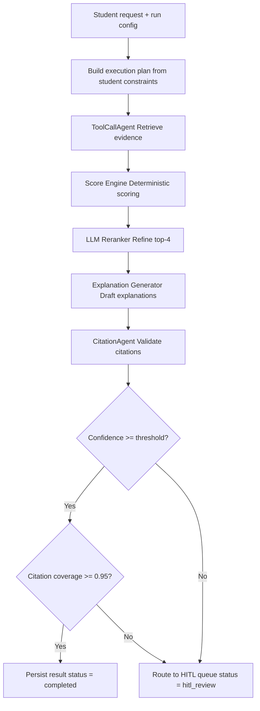

# TICKET-013: Orchestrator Agent

## Phase

**Phase 3 — Multi-Agent Explanation and Citation Validation**  
Ref: `implementation-plan.md §7 Phase 3` — "Add confidence gates and HITL case creation."

## Assignment Reference

- **assigment.md — Context (Phase 1):** "Automatically find the best-match teacher, plus 3 alternatives for the new students with an explanation for each match." The orchestrator coordinates the entire pipeline to produce this output.
- **implementation-plan.md §5 — Evaluation Plan — Quality Gates:** "Do not publish result when critical citation checks fail. Route low-confidence recommendations to HITL automatically."

## Design Document References

- [ai-pipeline.md — §5 Multi-Agent AI Design — OrchestratorAgent](../ai-pipeline.md): Coordinates agents and scoring pipeline, applies confidence threshold and HITL trigger.
- [ai-pipeline.md — §5.1 Recommendation Runtime Contract](../ai-pipeline.md): Full 6-step workflow from execution plan to final output or HITL.
- [ai-pipeline.md — §2 End-to-End Pipeline Flow](../ai-pipeline.md): Complete flowchart from student request to final output or HITL queue.
- [ai-pipeline.md — §5.5 Model Routing and Cost Optimization](../ai-pipeline.md): Escalate model tier only for high-ambiguity, high-impact decisions.
- [architecture.md — §6 Output Contract](../architecture.md): Expected JSON shape for `top_1` + `top_3_alternatives`.

## Description

Implement the `OrchestratorAgent` that coordinates the full recommendation pipeline for each student request. It builds an execution plan, invokes the ToolCallAgent, Score Engine, Reranker, Explanation Generator, and CitationAgent in sequence, and applies confidence and citation gates to determine whether the result is published or routed to HITL review.

## Acceptance Criteria

- [ ] `orchestrate_recommendation(student, config)` produces a complete recommendation result or triggers HITL handoff.
- [ ] Execution plan is built from student constraints and run configuration.
- [ ] Agent sequence: ToolCallAgent -> Score Engine -> Reranker -> Explanation Generator -> CitationAgent.
- [ ] **Confidence gate:** Blocks final output when overall confidence score < configurable threshold (default: 0.7).
- [ ] **Citation gate:** Blocks final output when citation coverage < 0.95 for any high-impact claim.
- [ ] **HITL trigger:** Routes to HITL queue when either gate fails, with reason code and supporting data.
- [ ] Output matches the architecture.md output contract: `top_1` + `top_3_alternatives`, each with `explanation` and `citations`.
- [ ] Both pre-HITL and post-HITL traces are stored when a rerun occurs.
- [ ] A `pipeline_trace_steps` entry records the full orchestration with all sub-step references.
- [ ] Orchestration handles partial agent failures gracefully (e.g., CitationAgent down -> mark as needs_review).
- [ ] **Task-aware model routing:** Orchestrator selects cheap/balanced/high-performance model tiers per step and context (simple post-processing vs normal ranking/explanations vs ambiguous high-impact adjudication).
- [ ] **Escalation policy:** High-performance tier is invoked only when uncertainty gates fail (for example low citation coverage with conflicting evidence, contradictory HITL notes).
- [ ] **Auditability:** Orchestration trace includes per-step `model_tier`, `model_name`, token usage, and escalation reason (when escalation occurs).

## Technical Details

### Orchestration Flow



### Output Assembly

```python
def assemble_output(student_id, request_id, ranked_teachers, explanations, citations):
    top_1 = build_teacher_result(ranked_teachers[0], explanations[0], citations[0], rank=1)
    alternatives = [
        build_teacher_result(ranked_teachers[i], explanations[i], citations[i], rank=i+1)
        for i in range(1, 4)
    ]
    return {
        "request_id": request_id,
        "student_id": student_id,
        "status": "completed",
        "top_1": top_1,
        "top_3_alternatives": alternatives
    }
```

### HITL Trigger Conditions

```python
def should_trigger_hitl(confidence_score, citation_coverage, config):
    if confidence_score < config.confidence_threshold:  # default: 0.7
        return True, "low_confidence"
    if citation_coverage < config.citation_threshold:    # default: 0.95
        return True, "low_citation_coverage"
    return False, None
```

## Dependencies

- **TICKET-012** — ToolCallAgent for evidence retrieval.
- **TICKET-007** — Deterministic Scoring Engine.
- **TICKET-008** — LLM Reranker.
- **TICKET-010** — Explanation Generator.
- **TICKET-011** — CitationAgent for validation.
- **TICKET-001** — Database schema (`recommendation_requests`, `recommendation_results`, `pipeline_trace_steps`).

## Test Plan

### Unit Tests
- **Execution plan builder:** Pass S001 with default config; verify plan includes all 5 agents in correct sequence. Pass S001 with `skip_reranker=true` config; verify reranker is omitted.
- **Confidence gate — pass:** Set `confidence_score=0.85` and threshold 0.7; verify gate passes.
- **Confidence gate — fail:** Set `confidence_score=0.5` and threshold 0.7; verify gate fails and HITL trigger fires with reason `low_confidence`.
- **Citation gate — pass:** Set `citation_coverage=0.98` and threshold 0.95; verify gate passes.
- **Citation gate — fail:** Set `citation_coverage=0.90` and threshold 0.95; verify HITL trigger fires with reason `low_citation_coverage`.
- **Output assembly:** Given 4 ranked teachers with explanations and citations; verify output matches the contract shape with `top_1` and `top_3_alternatives`.
- **Partial agent failure:** Simulate CitationAgent timeout; verify orchestrator marks result as `needs_review` instead of crashing.
- **Model routing policy:** Verify simple post-processing uses cheap tier, standard rerank/explain uses balanced tier, and uncertainty-triggered path escalates to high-performance tier.
- **Escalation reason logging:** Trigger escalation path; verify trace stores escalation reason and selected model tier.

### Integration Tests
- **Full orchestration for S001:** Run `orchestrate_recommendation(S001)` end-to-end; verify the output has 4 teachers with explanations and citations. Verify `recommendation_requests.status = 'completed'`.
- **HITL trigger for S003 (no matching teachers):** Run orchestration for S003 (Japanese/History); verify low confidence triggers HITL. Verify `recommendation_requests.status = 'hitl_review'`. Verify a `hitl_cases` row is created with `trigger_reason`.
- **Trace completeness:** After orchestration for S001, query `pipeline_trace_steps` for the `request_id`; verify entries exist for each stage (tool_call, scoring, reranking, explanation, citation, orchestration).
- **Output contract validation:** Parse the final output JSON; validate against the architecture.md contract schema (top_1 has teacher_id, rank, score, explanation, citations).

### E2E / Manual Tests
- **Full pipeline for all 3 students:** Run orchestration for S001, S002, S003. Verify:
  - S001: `status=completed` with 4 teachers.
  - S002: `status=completed` with 4 teachers (Programming/Math match).
  - S003: `status=hitl_review` (no matching teachers -> low confidence).
- **HITL rerun:** After S003 triggers HITL, add correction notes, trigger rerun; verify both pre-HITL and post-HITL traces are stored.

### Requirement Coverage Matrix
| Acceptance Criterion | Test Type | Test Description |
|---|---|---|
| AC: Produces complete result or HITL handoff | Integration | Full orchestration S001 + S003 |
| AC: Execution plan from student constraints | Unit | Execution plan builder |
| AC: Correct agent sequence | Integration | Trace completeness check |
| AC: Confidence gate blocks low confidence | Unit + Integration | Confidence gate tests + S003 HITL |
| AC: Citation gate blocks low coverage | Unit | Citation gate tests |
| AC: HITL trigger with reason code | Integration | HITL trigger for S003 |
| AC: Output matches contract shape | Unit + Integration | Output assembly + contract validation |
| AC: Pre-HITL and post-HITL traces stored | E2E | HITL rerun test |
| AC: Orchestration trace entry written | Integration | Trace completeness |
| AC: Partial failure handled gracefully | Unit | Partial agent failure test |
| AC: Task-aware model routing | Unit | Model routing policy test |
| AC: Escalation is reasoned and traceable | Unit + Integration | Escalation reason logging + trace completeness |

## Dataset References

- The orchestrator processes students from `dataset/new_students.json` against teachers from `dataset/teachers.json`.
- S001 (Math/Physics, beginner, structured) is the primary happy-path test case expected to produce `status=completed`.
- S003 (Japanese/History, beginner, structured) is the primary edge case expected to trigger HITL due to no matching teachers.
