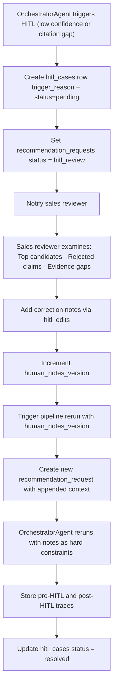

# TICKET-014: HITL Workflow

## Phase

**Phase 3 — Multi-Agent Explanation and Citation Validation**  
Ref: `implementation-plan.md §7 Phase 3` — "Add confidence gates and HITL case creation."

## Assignment Reference

- **implementation-plan.md §5 — Evaluation — Quality Gates:** "Route low-confidence recommendations to HITL automatically."
- **implementation-plan.md §5 — Online Evaluation:** "HITL trigger rate and HITL override rate" are key metrics.

## Design Document References

- [ai-pipeline.md — §6 HITL Rules](../ai-pipeline.md): Trigger conditions, sales reviewer capabilities, pipeline rerun with `human_notes_version`.
- [ai-pipeline.md — §6 HITL Reruns](../ai-pipeline.md): ToolCallAgent includes reviewer notes as hard constraints; CitationAgent revalidates; OrchestratorAgent stores both pre-HITL and post-HITL traces.
- [technical-proposal.md — §7 HITL Handoff and Sales Feedback](../technical-proposal.md): Trigger conditions, sales-side handoff model, HITL sequence diagram.
- [data-model.md — §2.4 HITL and Worker Audit](../data-model.md): `hitl_cases`, `hitl_edits` tables.
- [architecture.md — §4 — HITL Console](../architecture.md): Sales review workflow.

## Description

Implement the HITL (Human-in-the-Loop) workflow that handles low-confidence recommendations by routing them to a sales reviewer. The reviewer can add correction notes, adjust constraints, and trigger a pipeline rerun with the updated context.

## Acceptance Criteria

- [ ] When OrchestratorAgent triggers HITL, a `hitl_cases` row is created with `request_id`, `trigger_reason`, and `status='pending'`.
- [ ] `recommendation_requests.status` is set to `hitl_review`.
- [ ] Sales reviewer can view the HITL case, including: top candidates, rejected/low-confidence claims, evidence gaps, and citation coverage.
- [ ] Reviewer can add correction notes via `hitl_edits` with `editor_id`, `reason_code`, and note content.
- [ ] Correction notes update `human_notes_version` in the student/request context.
- [ ] Reviewer can trigger a pipeline rerun, which creates a new `recommendation_requests` entry with the appended `human_notes_version`.
- [ ] During rerun, ToolCallAgent includes reviewer notes as hard constraints in retrieval planning.
- [ ] During rerun, CitationAgent revalidates all claims (manual edits can invalidate prior citations).
- [ ] Both pre-HITL and post-HITL traces are stored in `pipeline_trace_steps` for auditability.
- [ ] `hitl_cases.status` transitions: `pending` -> `in_review` -> `resolved` | `rerun_triggered`.

## Technical Details

### HITL Workflow Flow



### HITL Case Creation

```python
def create_hitl_case(request_id, trigger_reason, candidates, citation_gaps):
    return db.insert("hitl_cases", {
        "request_id": request_id,
        "trigger_reason": trigger_reason,
        "status": "pending",
        "case_data": {
            "candidates": candidates,
            "citation_gaps": citation_gaps
        }
    })
```

### Correction Note Schema

```json
{
  "edit_id": "edit_001",
  "case_id": "case_123",
  "editor_id": "sales_reviewer_1",
  "reason_code": "demand_adjustment",
  "note_content": "Student specifically needs Physics for university entrance exam",
  "constraints_added": ["prioritize_physics_specialists"],
  "created_at": "2026-03-26T10:00:00Z"
}
```

## Dependencies

- **TICKET-013** — OrchestratorAgent triggers HITL via confidence/citation gates.
- **TICKET-001** — Database schema (`hitl_cases`, `hitl_edits`, `recommendation_requests`).
- **TICKET-012** — ToolCallAgent must support `human_notes_version` in retrieval planning.
- **TICKET-011** — CitationAgent must revalidate on rerun.

## Test Plan

### Unit Tests
- **Case creation fields:** Trigger HITL for a request; verify `hitl_cases` row has `request_id`, `trigger_reason` (e.g., "low_confidence"), `status='pending'`, and `case_data` containing candidates and citation gaps.
- **Status update:** After HITL trigger, verify `recommendation_requests.status = 'hitl_review'`.
- **Correction note persistence:** Add an edit with `editor_id`, `reason_code`, `note_content`; verify row in `hitl_edits` links to correct `case_id`.
- **human_notes_version increment:** After adding correction notes, verify `human_notes_version` is incremented.
- **Rerun flag:** Trigger rerun; verify a new `recommendation_requests` row is created with the updated `human_notes_version` in its context.
- **Case status transitions:** Verify `pending` -> `in_review` -> `rerun_triggered` transitions. Verify invalid transitions (e.g., `resolved` -> `pending`) are rejected.

### Integration Tests
- **Full HITL cycle:** Trigger HITL for S004 (low confidence) -> create case -> reviewer adds note "prioritize general teaching skills" -> trigger rerun -> verify new recommendation runs with notes as constraints -> verify both pre-HITL and post-HITL traces in `pipeline_trace_steps`.
- **Rerun uses notes as constraints:** After adding a correction note, trigger rerun; verify ToolCallAgent receives `human_notes_version` and adjusts retrieval (e.g., broader subject matching).
- **Citation revalidation on rerun:** After rerun, verify CitationAgent re-validates all claims (not reusing old citations). Verify new `recommendation_citations` rows are created.
- **Dual trace storage:** Query `pipeline_trace_steps` for the original and rerun request; verify both sets of traces exist.

### E2E / Manual Tests
- **Sales console walkthrough:** Open the HITL console; view S004's case (low confidence, no matching teachers); add a correction note; trigger rerun; verify updated recommendations are displayed. Verify the case status transitions from `pending` -> `in_review` -> `resolved`.
- **Audit trail verification:** After a full HITL cycle, query `hitl_cases` and `hitl_edits`; verify the complete history is recorded with editor IDs and timestamps.

### Requirement Coverage Matrix
| Acceptance Criterion | Test Type | Test Description |
|---|---|---|
| AC: hitl_cases row created on trigger | Unit | Case creation fields |
| AC: recommendation_requests.status = hitl_review | Unit | Status update test |
| AC: Reviewer can view case data | E2E/Manual | Sales console walkthrough |
| AC: Correction notes via hitl_edits | Unit | Correction note persistence |
| AC: human_notes_version updated | Unit | human_notes_version increment |
| AC: Pipeline rerun with notes | Integration | Full HITL cycle |
| AC: ToolCallAgent uses notes as constraints | Integration | Rerun uses notes as constraints |
| AC: CitationAgent revalidates on rerun | Integration | Citation revalidation on rerun |
| AC: Pre-HITL and post-HITL traces stored | Integration | Dual trace storage |
| AC: Case status transitions | Unit | Case status transitions |

## Dataset References

- S004 from `dataset/new_students.json` (Japanese/History goals) is the primary test case for HITL trigger — no matching teachers exist in `dataset/teachers.json`.
- After HITL correction notes (e.g., "match with teachers who have strong communication and patience"), the rerun may match S004 with T003 (English, structured, patience=97) or T009 (English, structured, communication=97) as "best available" teachers.
