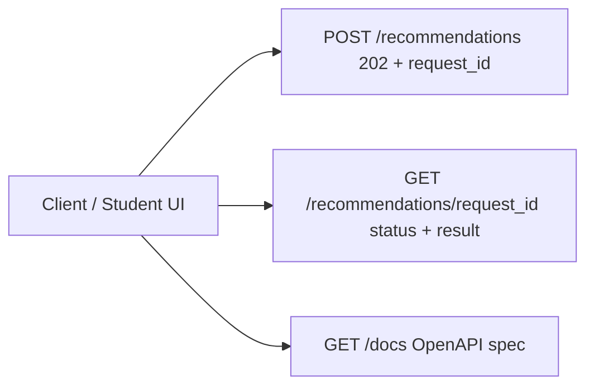

# TICKET-015: API Gateway

## Phase

**Phase 4 — API, UI, and Operational Hardening**  
Ref: `implementation-plan.md §7 Phase 4` and `assigment.md — Context (Phase 2)` — "Expose an API so external systems or clients can trigger the recommendation pipeline."

## Assignment Reference

- **assigment.md — Context (Phase 2):** "Expose an API so external systems or clients can trigger the recommendation pipeline."
- **assigment.md — Context (Phase 2):** "The UI triggers the pipeline via the API, but the pipeline runs in the background."

## Design Document References

- [architecture.md — §4 — API Gateway](../architecture.md): "Validates payloads, creates async requests, returns request_id, enforces rate limits, serves cached status."
- [architecture.md — §4.1 Async Recommendation Flow](../architecture.md): Sequence diagram — POST /recommendations -> 202 + request_id -> poll GET.
- [architecture.md — §6 Output Contract](../architecture.md): JSON shape for recommendation responses.
- [architecture.md — §6 High-Concurrency Output Management](../architecture.md): Write-once state machine, idempotent writes, poll-friendly API, hot-read protection.

## Description

Implement the Fastify API Gateway that exposes the recommendation pipeline to external clients. The API accepts recommendation requests asynchronously (returning a `request_id` for polling) and serves recommendation results when complete.

## Acceptance Criteria

- [ ] `POST /recommendations` accepts a student profile, creates a recommendation request, enqueues a job, and returns `202 Accepted` with `{ request_id }`.
- [ ] `GET /recommendations/{request_id}` returns the current status and result:
  - `processing`: compact payload with `retry_after_seconds`.
  - `completed`: full payload matching the output contract (`top_1` + `top_3_alternatives` + explanations + citations).
  - `failed`: error payload with reason.
  - `hitl_review`: status indicating manual review in progress.
- [ ] Request validation rejects payloads missing `learning_goals` or `weak_areas` with `400 Bad Request`.
- [ ] **Rate limiting:** Per-student and per-IP rate limits (configurable, default: 5 req/min per IP).
- [ ] Rate-limited requests return `429 Too Many Requests` with `Retry-After` header.
- [ ] **Status caching:** Latest request status is cached (short TTL, default: 3s) to absorb polling spikes.
- [ ] **OpenAPI spec:** Swagger/OpenAPI documentation is served at `/docs`.
- [ ] **Idempotency:** Duplicate POST with the same student profile within a window returns the existing `request_id` instead of creating a duplicate.
- [ ] Response headers include `X-Request-Id` for tracing.

## Technical Details

### API Endpoints



### POST /recommendations Request

```json
{
  "student_id": "S001",
  "name": "Student 1",
  "age": 15,
  "learning_goals": ["Understand core Math concepts", "Build confidence in Physics"],
  "weak_areas": ["Algebra", "Geometry", "Newton's Laws"],
  "current_level": "beginner",
  "preferred_learning_style": "structured"
}
```

### POST Response (202)

```json
{
  "request_id": "req_abc123",
  "status": "queued",
  "retry_after_seconds": 3
}
```

### GET Response (completed)

Returns the full output contract from architecture.md §6.

### Rate Limiting

```typescript
fastify.register(rateLimiter, {
  max: 5,
  timeWindow: '1 minute',
  keyGenerator: (req) => req.ip,
  errorResponseBuilder: (req, context) => ({
    statusCode: 429,
    error: 'Too Many Requests',
    message: `Rate limit exceeded. Retry after ${context.ttl}ms`,
  })
});
```

### Status Cache

```typescript
const statusCache = new LRUCache<string, RecommendationStatus>({
  max: 10000,
  ttl: 3000 // 3 seconds
});
```

## Dependencies

- **TICKET-000** — Repo structure, `packages/api` scaffold.
- **TICKET-001** — Database schema (`recommendation_requests`).
- **TICKET-009** — Recommendation Batch Worker for job processing.
- **TICKET-002** — Teacher ingestion endpoints (already in API).
- **TICKET-003** — Student ingestion endpoints (already in API).

## Test Plan

### Unit Tests
- **Request validation — missing learning_goals:** POST with empty `learning_goals`; verify 400 response with descriptive error.
- **Request validation — missing weak_areas:** POST without `weak_areas` field; verify 400.
- **Request validation — valid payload:** POST with complete S001 data; verify 202 response with `request_id`.
- **Rate limiter — within limit:** Send 5 requests from same IP within 1 minute; verify all return 202.
- **Rate limiter — exceeded:** Send 6th request from same IP within 1 minute; verify 429 with `Retry-After` header.
- **Response schema — processing:** Mock a `processing` status; verify GET returns compact payload with `retry_after_seconds` and no result data.
- **Response schema — completed:** Mock a `completed` status with full result; verify GET returns `top_1` + `top_3_alternatives` matching the output contract.
- **Idempotency:** POST the same student profile twice within 60s; verify same `request_id` is returned (not a duplicate).

### Integration Tests
- **POST + GET polling cycle:** POST S001 recommendation; poll GET until `status=completed`; verify the full response matches the output contract JSON shape from architecture.md.
- **Cache hit verification:** POST a request, wait for processing, then GET 10 times in rapid succession; verify cache is hit (response time < 5ms for cached responses).
- **OpenAPI spec:** GET `/docs`; verify Swagger UI renders. GET `/docs/json`; verify the OpenAPI schema includes both endpoints with correct request/response schemas.
- **X-Request-Id header:** POST and GET; verify both responses include `X-Request-Id` header.
- **Error response for unknown request_id:** GET `/recommendations/nonexistent`; verify 404 response.

### E2E / Manual Tests
- **Full recommendation via API:** POST S001 profile via API -> poll GET until completed -> verify full response with `top_1`, `top_3_alternatives`, explanations, and citations. Cross-reference teacher data against `teachers.json`.
- **Rate limit test:** Use a load testing tool to send 10 requests from the same IP in 1 minute; verify the first 5 succeed and the remaining 5 return 429.
- **OpenAPI validation:** Open `/docs` in a browser; verify all endpoints are documented, try-it-out buttons work.

### Requirement Coverage Matrix
| Acceptance Criterion | Test Type | Test Description |
|---|---|---|
| AC: POST returns 202 + request_id | Unit + Integration | Valid payload test + POST+GET cycle |
| AC: GET returns status variants | Unit | Response schema tests (processing/completed) |
| AC: Rejects invalid payloads with 400 | Unit | Validation tests |
| AC: Rate limiting with 429 | Unit + E2E | Rate limiter tests |
| AC: Status caching (short TTL) | Integration | Cache hit verification |
| AC: OpenAPI at /docs | Integration + E2E | OpenAPI spec + browser validation |
| AC: Idempotent duplicate POST | Unit | Idempotency test |
| AC: X-Request-Id header | Integration | Header verification |

## Dataset References

- `dataset/new_students.json` provides the test payloads for POST requests. S001 is the primary happy-path test case.
- `dataset/teachers.json` data appears in the completed recommendation response (teacher names, scores, etc.).
