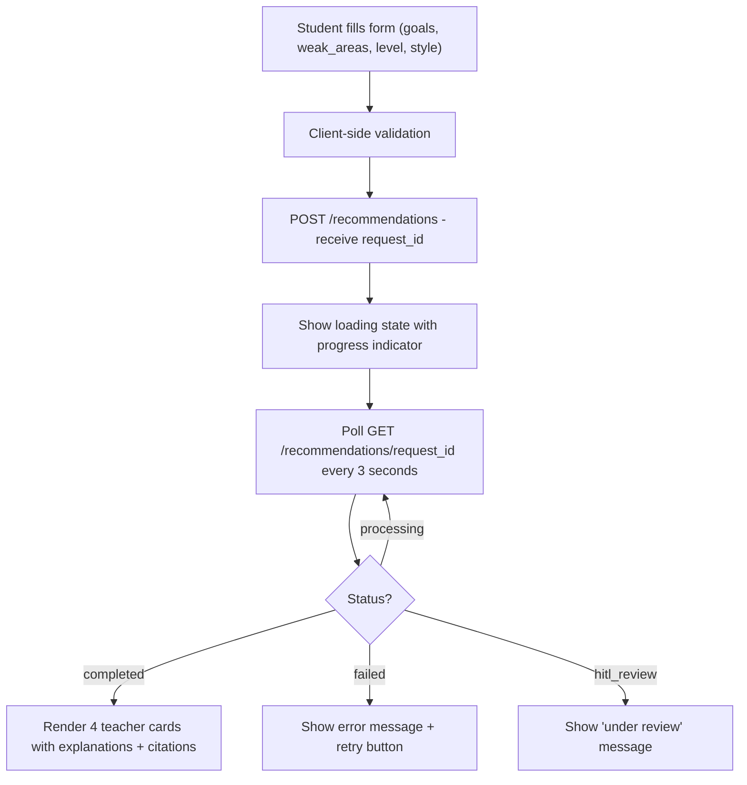

# TICKET-016: Student UI

## Phase

**Phase 4 — API, UI, and Operational Hardening**  
Ref: `assigment.md — Context (Phase 2)` — "Implement a UI where a student can input their information and receive recommendations."

## Assignment Reference

- **assigment.md — Context (Phase 2):** "Implement a UI where a student can input their information and receive recommendations."
- **assigment.md — Context (Phase 2):** "The UI triggers the pipeline via the API, but the pipeline runs in the background."

## Design Document References

- [architecture.md — §4 — Student UI](../architecture.md): "Collects student profile and learning goals, calls async API and polls/refreshes by request_id, displays ranked recommendations and explanations."
- [architecture.md — §4.1 Async Recommendation Flow](../architecture.md): UI -> POST /recommendations -> 202 -> poll GET -> display results.
- [architecture.md — §6 Output Contract](../architecture.md): JSON shape the UI must render.
- [architecture.md — §7 Minimum Viable Assignment Path](../architecture.md): Student submits form, API processes async, UI polls and displays.

## Description

Implement the student-facing web application that allows students to submit their profile and learning goals, triggers the recommendation pipeline via the API, and displays the results (top-1 best match + 3 alternatives) with explanations and citations.

## Acceptance Criteria

- [ ] A web form collects: name, age, learning_goals (multi-input), weak_areas (multi-input), current_level (dropdown), preferred_learning_style (dropdown).
- [ ] Form validation prevents submission with empty `learning_goals` or `weak_areas`.
- [ ] On submit, the UI calls `POST /recommendations` and receives a `request_id`.
- [ ] A loading/processing state is displayed while the pipeline runs in the background.
- [ ] The UI polls `GET /recommendations/{request_id}` at a configurable interval (default: 3s) until `status=completed` or `status=failed`.
- [ ] On `status=completed`, the UI renders 4 teacher recommendation cards:
  - Best match (rank 1) with a highlighted badge.
  - 3 alternatives (ranks 2-4).
  - Each card shows: teacher name, subjects, teaching style, score, explanation summary, match reasons, and citations.
- [ ] On `status=failed`, the UI displays an error message with retry option.
- [ ] On `status=hitl_review`, the UI displays a message that the request is under manual review.
- [ ] The UI is responsive and renders correctly on desktop and mobile viewports.

## Technical Details

### UI Flow

### Teacher Recommendation Card Layout

Each card displays:
- **Header:** Teacher name + rank badge (gold for #1)
- **Subjects:** Tag list of subjects taught
- **Score:** Visual score bar (0-100%)
- **Style:** Teaching style indicator
- **Explanation:** Summary text
- **Match Reasons:** Bulleted list of specific reasons
- **Citations:** Collapsible section showing evidence sources

### Technology Stack

- Framework: React or Next.js (from `packages/student-ui`)
- Styling: Tailwind CSS or CSS Modules
- State management: React Query or SWR for polling
- Form handling: React Hook Form or equivalent

## Dependencies

- **TICKET-000** — Repo structure, `packages/student-ui` scaffold.
- **TICKET-015** — API Gateway endpoints must be functional.

## Test Plan

### Unit Tests
- **Form validation — empty goals:** Attempt to submit with empty `learning_goals[]`; verify submit button is disabled or form shows validation error.
- **Form validation — empty weak_areas:** Attempt to submit with no weak areas; verify validation error.
- **Form validation — valid data:** Fill all required fields; verify submit button is enabled and form data is correctly shaped.
- **Polling logic — processing:** Mock API returning `status=processing`; verify polling continues at 3s intervals.
- **Polling logic — completed:** Mock API returning `status=completed` with full result; verify polling stops and result is displayed.
- **Polling logic — failed:** Mock API returning `status=failed`; verify polling stops and error message with retry button is shown.
- **Result card rendering:** Pass a mock completed response with 4 teachers; verify 4 cards are rendered with correct teacher names, scores, explanations, and citations.
- **Best match badge:** Verify rank 1 card has a distinct visual indicator (e.g., gold badge, "Best Match" label).

### Integration Tests
- **Form submit -> API call:** Fill form with S001 data and submit; verify `POST /recommendations` is called with the correct payload. Verify `request_id` is stored for polling.
- **Full polling cycle:** Submit S001 via UI form; mock API returns `processing` twice then `completed`; verify loading state is shown, then results are rendered.
- **Error state rendering:** Submit form; mock API returns `processing` then `failed`; verify error message is displayed with retry button. Click retry; verify new request is made.
- **HITL state rendering:** Mock API returning `status=hitl_review`; verify "under manual review" message is displayed.

### E2E / Manual Tests
- **Happy path — S001:** Open browser, fill form with S001 data (goals: "Understand core Math concepts" + "Build confidence in Physics", weak areas: Algebra/Geometry/Newton's Laws, level: beginner, style: structured). Submit, wait for results, verify 4 teacher recommendation cards displayed with explanations and citations. Verify T001 appears in results.
- **Edge case — S003:** Fill form with S003 data (Japanese/History goals). Submit, verify the UI handles the response (either HITL review message or low-confidence results).
- **Mobile responsiveness:** Open the app on a mobile viewport (375px wide); verify the form and result cards render correctly without horizontal scroll.
- **Retry after failure:** Simulate network failure on POST; verify error message is shown; click retry; verify new request succeeds.

### Requirement Coverage Matrix
| Acceptance Criterion | Test Type | Test Description |
|---|---|---|
| AC: Form collects all required fields | Unit | Form validation tests |
| AC: Validation prevents empty goals/weak_areas | Unit | Empty field validation tests |
| AC: Calls POST /recommendations on submit | Integration | Form submit -> API call |
| AC: Loading state during processing | Integration | Full polling cycle |
| AC: Polls GET until completed/failed | Unit + Integration | Polling logic tests |
| AC: Renders 4 teacher cards on completed | Unit | Result card rendering |
| AC: Error message on failed | Unit + Integration | Failed state rendering |
| AC: HITL review message | Integration | HITL state rendering |
| AC: Responsive on desktop + mobile | E2E/Manual | Mobile responsiveness test |

## Dataset References

- `dataset/new_students.json` provides test data for form filling: S001 (Math/Physics, beginner, structured), S002 (Programming/Math, beginner, structured), S003 (Japanese/History, beginner, structured).
- `dataset/teachers.json` teacher names and data appear in the recommendation result cards.
