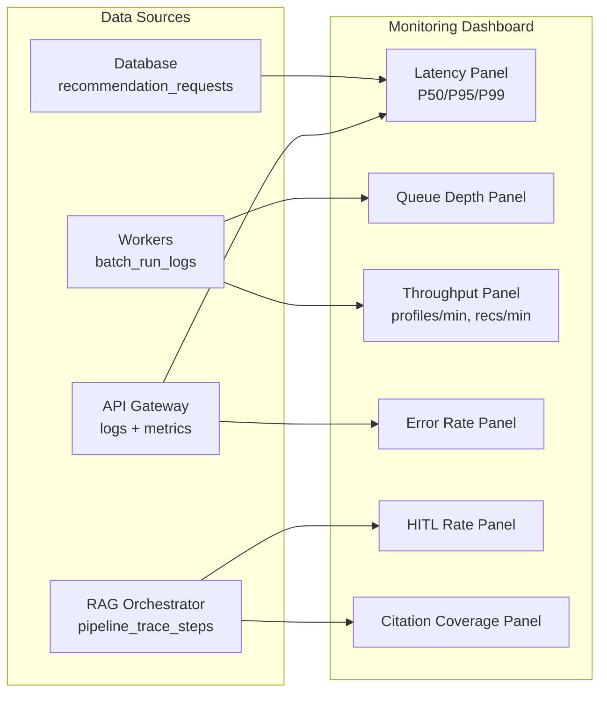

# TICKET-017: Observability and Load Testing

## Phase

**Phase 4 — API, UI, and Operational Hardening**  
Ref: `implementation-plan.md §7 Phase 4` — "Add observability dashboards, SLO alerts, and load tests. Tune batch size (5-10) and retry policies under stress."

## Assignment Reference

- **implementation-plan.md §2 — Concurrency Plan:** "Autoscale workers based on queue depth and processing latency." Observability enables this.
- **implementation-plan.md §4 — Data Freshness — Operational Targets:** "Freshness SLO: 99% of profile updates indexed within 5 minutes. Freshness alerts trigger when indexing lag breaches threshold."
- **implementation-plan.md §5 — Evaluation Plan:** Offline and online metrics, quality gates.
- **technical-proposal.md — §9 AI Pipeline Operational Controls — Quality Metrics:** retrieval_recall_at_k, citation_coverage_rate, unsupported_claim_rate, hitl_trigger_rate, recommendation_acceptance_lift.

## Design Document References

- [technical-proposal.md — §2 NFR-1](../technical-proposal.md): "P95 recommendation response < 8 seconds at baseline load."
- [technical-proposal.md — §2 NFR-2](../technical-proposal.md): "RAG retrieval availability >= 99.9% monthly."
- [technical-proposal.md — §2 NFR-3](../technical-proposal.md): "Supports bursts of 1,000 concurrent requests via queue-backed workers."
- [architecture.md — §8 High Availability Strategy](../architecture.md): Multi-AZ, queue decoupling, DLQ, idempotent workers, graceful fallback.

## Description

Implement observability infrastructure (dashboards, metrics, alerts) and load testing suites that validate the system meets its SLOs under stress. This ticket ensures production readiness by verifying concurrency handling, retry policies, and batch size tuning.

## Acceptance Criteria

- [ ] **Dashboards:** A monitoring dashboard displays key metrics:
  - Recommendation latency (P50, P95, P99)
  - Queue depth (indexing queue + recommendation queue)
  - Worker throughput (profiles/min, recommendations/min)
  - Error rate by component (API, workers, RAG orchestrator, LLM calls)
  - HITL trigger rate
  - Citation coverage rate
  - LLM input/output token usage and estimated cost per student
  - Model-tier usage distribution (cheap vs balanced vs high-performance) by pipeline step
- [ ] **SLO alerts:** Alerts fire when:
  - Recommendation P95 latency > 8 seconds
  - RAG retrieval availability drops below 99.9%
  - Profile indexing freshness lag > 5 minutes
  - Error rate > 1% sustained for 5 minutes
- [ ] **Autoscaling policy alerts/monitors:** Recommendation worker scale-up condition is tracked for queue depth > `50` or processing P95 > `5s`; scale-down condition is tracked after `5` consecutive minutes of empty queue; max worker cap `10` is enforced.
- [ ] **Load tests:** A load test suite exercises the system with:
  - 100 concurrent recommendation requests (baseline)
  - 1,000 concurrent requests (burst test)
  - Verify all requests complete within timeout
- [ ] **Capacity benchmark checks:** Validate plan targets under representative environment:
  - 1 worker, batch size 5: ~25 students/min (100 students drains in ~4 minutes)
  - 3 workers, batch size 10: ~75 students/min (1,000 students drains in ~14 minutes)
  - 10 workers, batch size 10: ~250 students/min (1,000 students drains in ~4 minutes)
- [ ] **Batch size tuning:** Load test validates that batch size of 5-10 performs optimally:
  - Measure throughput at batch sizes 5, 7, 10
  - Document the optimal batch size for the tested hardware
- [ ] **Retry policy validation:** Under simulated LLM failures (50% error rate), verify:
  - Exponential backoff is applied
  - DLQ receives only truly unrecoverable failures
  - Successful requests are not delayed by failing ones
- [ ] **Graceful degradation:** During LLM provider outage, verify:
  - Deterministic ranking still produces results
  - Fallback explanations are generated
  - No requests are permanently stuck

## Technical Details

### Dashboard Metrics



### Load Test Configuration

```yaml
scenarios:
  baseline:
    executor: constant-arrival-rate
    rate: 100
    duration: '5m'
    preAllocatedVUs: 50
  burst:
    executor: ramping-arrival-rate
    startRate: 10
    stages:
      - target: 1000
        duration: '2m'
      - target: 1000
        duration: '3m'
      - target: 0
        duration: '1m'
```

### SLO Definitions

| SLO | Target | Alert Threshold | Window |
|---|---|---|---|
| Recommendation P95 latency | < 8s | > 8s sustained 2min | 5min rolling |
| RAG retrieval availability | >= 99.9% | < 99.9% | 30day rolling |
| Profile indexing freshness | <= 5min | > 5min for any update | Per update |
| Error rate | < 1% | > 1% sustained 5min | 5min rolling |
| Recommendation worker P95 processing latency | <= 5s | > 5s (scale-up signal) | 5min rolling |
| Recommendation queue depth | <= 50 msgs | > 50 (scale-up signal) | Near real-time |

## Dependencies

- **All previous tickets** — The full system must be functional for load testing.
- **TICKET-000** — Infrastructure (monitoring stack in Docker Compose).
- **TICKET-009** — Recommendation Batch Worker (primary target for batch tuning).

## Test Plan

### Unit Tests
- **Dashboard query definitions:** Verify each dashboard panel query returns data from the expected table (`batch_run_logs` for throughput, `pipeline_trace_steps` for latency, `recommendation_requests` for status counts).
- **SLO alert threshold config:** Verify alert rules match spec: P95 > 8s triggers, availability < 99.9% triggers, freshness > 5min triggers, error rate > 1% triggers.
- **Metric aggregation:** Given sample data in `pipeline_trace_steps`, verify P50/P95/P99 calculations are correct.

### Integration Tests
- **Baseline load test (100 concurrent):** Submit 100 recommendation requests concurrently; verify all complete (status=completed or status=hitl_review) within the timeout window. Record P95 latency and verify < 8s.
- **Burst load test (1,000 concurrent):** Ramp up to 1,000 concurrent requests; verify the system remains responsive (no hung requests). Verify queue backpressure is applied correctly. Record throughput and error rate.
- **Autoscaling trigger checks:** Force queue depth > 50 and separately force worker processing latency P95 > 5s; verify autoscaling actions are emitted and bounded by max 10 workers.
- **Batch size tuning:** Run the load test at batch sizes 5, 7, and 10; record throughput (recommendations/min) at each size. Document which size performs best.
- **Capacity benchmark validation:** Run benchmark scenarios (1 worker @ batch 5, 3 workers @ batch 10, 10 workers @ batch 10); compare measured throughput and queue drain times against plan targets and document variance.
- **Retry policy under LLM failure:** Inject 50% LLM failure rate; run 50 recommendations; verify exponential backoff is applied (check timestamps in DLQ messages). Verify at least 50% of requests still complete successfully (via deterministic fallback).
- **Graceful degradation:** Block LLM endpoint entirely; submit 10 recommendations; verify all 10 produce results (deterministic ranking + fallback explanations).
- **Model-tier policy verification:** Run mixed workloads and verify high-performance tier usage is limited to uncertainty-triggered cases while simple tasks stay on cheap tier.

### E2E / Manual Tests
- **Dashboard review after load test:** After running the burst load test, open the monitoring dashboard. Verify:
  - Recommendation latency P95 is displayed and < 8s at baseline load.
  - Queue depth peaked during burst and returned to near-zero after completion.
  - Worker throughput is displayed with correct profiles/min and recommendations/min.
  - Error rate is displayed and remained < 1% during baseline.
  - HITL trigger rate is shown (should be non-zero for S003-like students).
  - Citation coverage rate is shown and >= 95% for successful recommendations.
- **DLQ inspection:** After the retry policy test, inspect the DLQ; verify it contains only messages that failed all 3 retries (not prematurely routed messages).
- **SLO alert validation:** Artificially breach the P95 latency SLO (add artificial delay); verify the alert fires within the configured window.

### Requirement Coverage Matrix
| Acceptance Criterion | Test Type | Test Description |
|---|---|---|
| AC: Dashboard with key metrics | Unit + E2E | Query definitions + dashboard review |
| AC: SLO alerts fire correctly | Unit + E2E | Threshold config + alert validation |
| AC: 100 concurrent baseline test | Integration | Baseline load test |
| AC: 1,000 concurrent burst test | Integration | Burst load test |
| AC: Autoscaling depth/latency triggers tracked | Integration | Autoscaling trigger checks |
| AC: Capacity benchmarks validated | Integration | Capacity benchmark validation |
| AC: Batch size tuning (5-10) | Integration | Batch size tuning test |
| AC: Model-tier usage is cost-optimized | Integration | Model-tier policy verification |
| AC: Retry policy with exponential backoff | Integration | Retry policy under LLM failure |
| AC: DLQ for unrecoverable failures | E2E/Manual | DLQ inspection |
| AC: Graceful degradation during LLM outage | Integration | Graceful degradation test |

## Dataset References

- Load tests use synthetic student profiles modeled on the structure of `dataset/new_students.json` (same fields, varied values).
- `dataset/teachers.json` teachers must be indexed before load testing begins.
- At scale, the 10-teacher pool means all students query the same teacher corpus — useful for testing cache hit rates and vector retrieval consistency.
